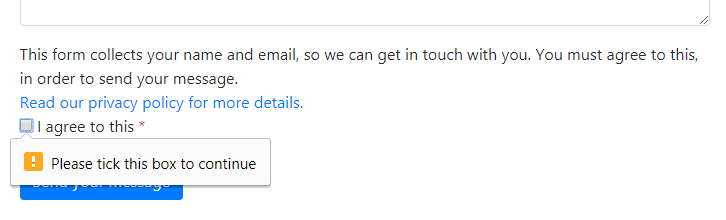
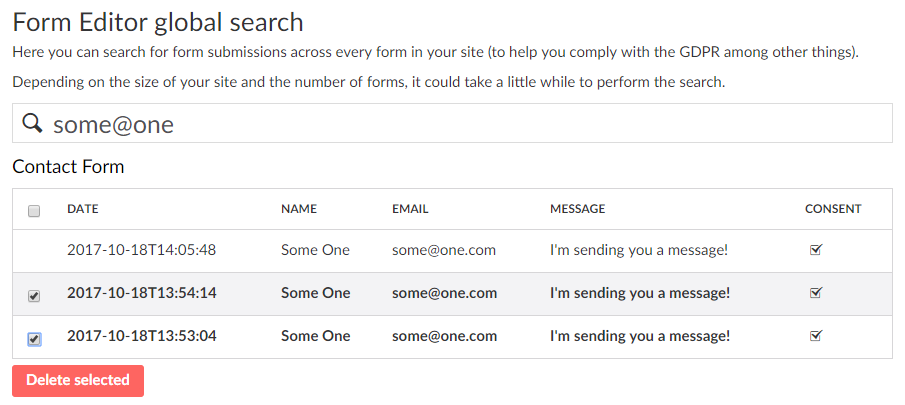

# GDPR - the General Data Protection Regulation
The GDPR comes into effect on 25 May 2018. If you're collecting personal data of any kind (names, emails etc.), you need to implement the GDPR on your site.

##Disclaimer
This document isn't legal advice, nor does it strive to be. It does not cover the GDPR in its full extend. It is your own responsibility to seek out adequate information - for example [here](http://www.eugdpr.org/). 

This document will be updated continuously as the implications of the GDPR are uncovered. If you have anything to add to the document, please [raise an issue](https://github.com/kjac/FormEditor/issues/new).

## What's this GDPR got to do with me?

The GDPR has several points you need to be aware of. Some of these points aren't exactly new, but in the light of the penalties built into the GDPR, they may carry more weight than before.

### Consent

Before collecting personal data, you have to aquire explicit consent from your users. The consent must:
- be written in a simple and easily understandable language (no legal mumbo jumbo). 
- be specific about what data is being collected and for what purpose.
- be given in context of the form submission and cannot be mixed with other matters (you can't just link to a general "Terms" page).

### Data minimisation

You're only allowed to collect the bare minimum of personal data that's required for processing the data.

### Data retention periods

You must ensure that personal data isn't kept any longer than is necessary for processing the data. 

### Right of access

You must provide your users with a means to obtain a copy of the personal data you have collected about them.

### Right to erasure ("the right to be forgotten")

You must provide your users with a means to have their personal data deleted.

### Reporting data breaches

In case of a data breach that is likely to "result in a risk for the rights and freedoms of individuals", you must notify your users about the breach within 72 hours of becoming aware of it.

## Form Editor and the GDPR

The list above might seem like a bit of a mouthful when you start dwelwing into the repercussions of each individual item. Fortunately Form Editor has you covered.

### Consent

Form Editor supports adding content fields (text paragraphs, links etc.) directly within the form layout, so you're off to a great start there. 

On top of that there's a special field type called *Submission consent* that's specifically minded at aquiring GDPR consent. The *Submission consent* field is made up by:

- a mandatory checkbox for the actual user consent.
- a consent text paragraph that is specifically tailored for the concrete form.
- a link to your site's privacy policy (if one exists), where you can elaborate in detail how personal data is handled.

### Data minimisation

This is pretty straight forward; just don't add fields you don't really need. The simplest rule of thumb is: If you're having a hard time explaining why you're collecting certain data in your consent text, you probably don't need that data.

### Data retention periods

The content editors can delete form submissions from their forms at any time. However, chances are this will be forgotten every so often, leaving submissions to grow stale and in violation with the GDPR. That's why Form Editor includes an option to let the editors can specify a maximum lifetime for form submissions, after which they will be deleted automatically.

*Note that you need to [enable this option](install.md#other-configuration-options) explicitly.*

### Right of access, Right to erasure

The simplest way to comply with these two is to provide your users with the email address of someone who can find and purge personal data. To ease the burden of this task, Form Editor ships with a dashboard that lets you search for form submissions across all forms on your site (the dashboard is located in the developer section). 

But... even with the option to search across all forms, this solution might not scale very well to your needs. Fortunately there's another option.

With Form Editor it's easy to create a page where the users can view and delete their own submitted data. Simply include a link to this page in the receipt email and voilà - you've turned GDPR compliance into self service. Check [this tutorial](../Tutorials/SelfService.md) for implementation details.

### Reporting data breaches

TODO

