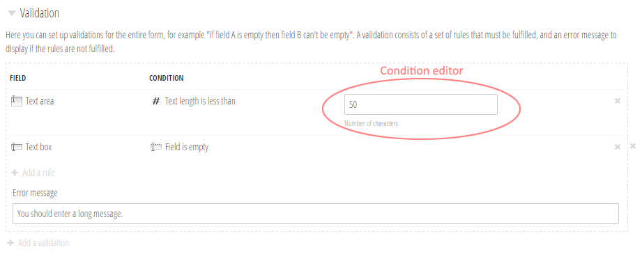

# Creating an advanced custom condition
An advanced custom condition is created by completing these steps:

1. Create your icon.
2. Implement your condition.
3. Create the editor to configure your condition.
4. Implement JS for the frontend.

Just as is the case with custom fields, Form Editor matches everything up by the `Type` property of the conditions, so this needs to be unique across all conditions.

Deployment wise, all you need to do is copy your DLL and the rest of your condition assets to your site. Form Editor will automatically detect your condition when the site restarts.

### Sample project structure and assets
A sample implementation of a custom condition for evaluating the length of a field value can be found under [Samples](../Samples/Custom validation condition/).

The condition assets (icon and editor) are included in the sample project. The directory structure in which they are placed mirrors the structure of your site. If you copy the *App_Plugins* folder directly to your site, the assets will be placed correctly under */App_Plugins/FormEditor/editor/conditions/*.

## Create your icon
To create your condition icon, follow the same guide lines as when creating icons for [custom fields](extend_field.md). Your condition icon must be named after the `Type` property of your condition, same as when creating a custom field.

## Implement your condition
The full the implementation of a condition will not be discussed here. Have a look at the sample implementation for details. Pay special attention to the following:

### The `IsMetBy()` method
Form Editor invokes this when performing cross field validation on the server side. Please remember that it's purpose is *not* to validate the field value, but to check whether the field value meets your condition. 

### Rendering for frontend
If your condition has configuration properties that should be passed to the frontend JS, you need to:

1. Create a class that inherits `ConditionData` to hold your configuration properties.
2. Override `ForFrontEnd()` and return the necessary properties in an instance of this class.

The sample implementation shows an example of how to do this.

## Create the editor to configure your condition


You'll need to create an editor to configure the properties of your condition. Check the [editor in the sample implementation](../Samples/Custom validation condition/App_Plugins/FormEditor/editor/conditions/my.length.html) for details on how to do this.

Even if your condition has no properties to configure, you still must create an editor for it. In this case, just create an editor that contains an empty `<div>`.

## Implement JS for the frontend
The JS used by the [sample templates](../Source/Umbraco/Views/) supports plugging in custom JS to handle your condition as part of the frontend.

This is done a bit differently depending on your choice of either [synchronous form postback](../Source/Umbraco/Views/FormEditorSync.cshtml) or [asynchronous form postback](../Source/Umbraco/Views/FormEditorAsync.cshtml). Both ways however have the same entry point for plugging in your custom JS: 

```javascript
addFormEditorCondition(type, callback)
```

This function exists in the global scope to make your life a bit easier. The parameters are as follows:
* `type`: The condition `Type` property.
* `callback`: A function that returns `true` if your condition is met and `false` otherwise. The function parameters vary between synchronous and asynchronous form postback, and are explained below.

### `callback` function for synchronous form postback
The `callback` function signature should be:

```javascript
function (rule, fieldValue, $form)
```

The parameters are as follows:
* `rule`: The rule being evaluated. Remember, a rule consist of a field and a condition.
* `fieldValue`: The field value to match against the condition. 
* `$form`: The current `<form>` element as a jQuery object.

### `callback` function for asynchronous form postback
The `callback` function signature should be:

```javascript
function (rule, fieldValue, formData)
```

The parameters are as follows:
* `rule`: The rule being evaluated. Remember, a rule consist of a field and a condition.
* `fieldValue`: The field value to match against the condition. 
* `formData`: The current `<form>` data as an indexable object - e.g. `formData["Text_box"]` yields the value of the `Text_box` field.
