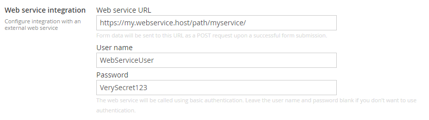

# Setting up web service integration
Form Editor can send form data automatically to an external web service upon a successful form submission. This is configured per Form Editor data type in the **Web service** section of the data type configuration:



Whenever a form is submitted to a page that contains this data type, Form Editor will attempt to perform a POST request to this URL with the submitted data and a few other bits of useful information (see below). 

You can optionally enter a user name and a password, which will then be used to perform basic authentication when calling the web service.

*Note:* The submitted data will still be saved to the storage index and made available in the Umbraco back office. 

*Also note:* The POST request is a one-shot action. There is no retry policy - if the web service is not responding, the request will silently fail (the error will be logged to the Umbraco log). 

## The data format
The data is sent to the web service as a JSON object structured as follows:

```json
{
  "umbracoContentName": "A name",
  "umbracoContentId": 1234,
  "indexRowId": "fa7f92ff-2b64-4b44-a5e3-2323a431a3a9",
  "formData": [
    {
      "name": "Name",
      "formSafeName": "_Name",
      "type": "core.textbox",
      "submittedValue": "It's my name"
    },
    {
      "name": "Date",
      "formSafeName": "_Date",
      "type": "core.date",
      "submittedValue": "2017-04-15"
    },
    {
      "name": "Email",
      "formSafeName": "_Email",
      "type": "core.email",
      "submittedValue": "its@my.email"
    }
  ]
}
```

* `umbracoContentName` and `umbracoContentId` contain the name and ID of the page that the form was submitted to.
* `indexRowId` is the ID of the form submission in the storage index.
* `formData` is an array of the submitted form data fields. Each entry contains the name and "form safe name" of the field, the field type and of course the submitted field value.

## A sample web service
The following code listing contains a sample web service that can receive form data from Form Editor. It's written for ASP.NET Web API 2. Although it has no authentication setup, it should be a good starting point for you to create your own web service.

```cs
using System.Web.Http;

namespace MySite.Controllers.Api
{
  public class FormEditorSubmissionController : ApiController
  {
    [HttpPost]
    public IHttpActionResult Post(WebServiceData data)
    {
      // do stuff with the submitted data here

      return Ok();
    }
  }

  public class WebServiceData
  {
    public string UmbracoContentName { get; set; }

    public int UmbracoContentId { get; set; }

    public string IndexRowId { get; set; }

    public FormFieldData[] FormData { get; set; }
  }

  public class FormFieldData
  {
    public string Name { get; set; }

    public string FormSafeName { get; set; }

    public string Type { get; set; }

    public string SubmittedValue { get; set; }
  }
}
```

