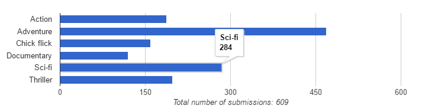

# Working with form submission statistics
If you've enabled form submission statics on your Form Editor data type and you'd like to work with the statistics on your frontend - you can! Here's how:

Start by retrieving the form model:

```cs
// get the form model (named "form" on the content type)
var form = Model.Content.GetPropertyValue<FormModel>("form");
```

The form model exposes the statistics for field value frequency through the method `GetFieldValueFrequencyStatistics()`. It can be used with the following parameters, all of which are optional:

- `IEnumerable<string> fieldNames`: The "form safe names" of the fields to retrieve statistics for. Default is all supported fields.
- `IPublishedContent content`: The content that holds the form. Default is current page.

Mind you, only a subset of the built-in Form Editor fields support field value frequency statistics, namely the ones that have a predefined value range (like radio button group, select box, etc).

### Sample template
Here's a full sample template that renders a bar chart (using [Google chart tools](https://developers.google.com/chart/)) of the field value frequencies for the field "genres":

```xml
@using FormEditor;
@inherits Umbraco.Web.Mvc.UmbracoTemplatePage
@{
  Layout = null;

  // get the form model (named "form" on the content type)
  var form = Model.Content.GetPropertyValue<FormModel>("form");
  
  // get the field value frequency statistics for the field "genres" (if it exists)  
  var statistics = form.GetFieldValueFrequencyStatistics(new[] { "genres" });
  var fieldValueFrequencies = statistics.FieldValueFrequencies.FirstOrDefault();
}
<!DOCTYPE html>
<html>
<head>
  <title>@Model.Content.Name</title>
  <link rel="stylesheet" href="http://getbootstrap.com/dist/css/bootstrap.min.css" />
  @if(fieldValueFrequencies != null)
  {
    
    @* read all about Google chart tools at https://developers.google.com/chart/ *@
    <script type="text/javascript" src="https://www.gstatic.com/charts/loader.js"></script>
    <script>
      google.charts.load("current", {packages: ["corechart", "bar"]});
      google.charts.setOnLoadCallback(drawChart);

      function drawChart() {

        @* this is the chart data. the first entry contains the chart legend - gonna leave that empty. *@
        var chartData = [
          ["", ""]
        ];

        @* add the field values and their frequencies *@
        @foreach(var fieldValueFrequency in fieldValueFrequencies.Frequencies)
        {
          @: chartData.push(["@fieldValueFrequency.Value", @fieldValueFrequency.Frequency]);
        }

        @* do the Google charts stuff *@
        var data = google.visualization.arrayToDataTable(chartData);
        var options = {
          chartArea: {width: "60%"},
          hAxis: {
            minValue: 0,
            title: "Total number of submissions: @statistics.TotalRows"
          },
          legend: "none"
        };
        var chart = new google.visualization.BarChart(document.getElementById("chart"));
        chart.draw(data, options);
      }
    </script>
  }
</head>
<body>
  @* this is where the chart will be rendered *@
  <div id="chart"></div>
</body>
</html>
```

The output should come out something like this:



## Wait... what about async?
Nope, sorry. There's no public endpoint for retrieving form submissions or statistics asynchronously. It would be a major security problem to have that.

## Next step
Onwards to [editing form submissions](submissions_edit.md) or read about [extending Form Editor](extend.md).