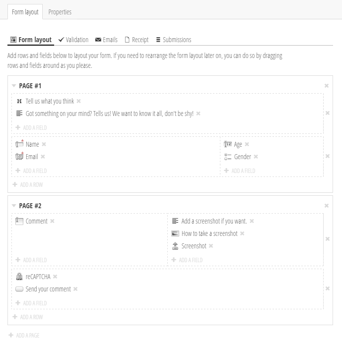

# Form Editor for Umbraco

Form Editor is a package for [Umbraco](http://umbraco.com/) 7.3+ that lets the editors create forms and manage form submissions as just another part of the Umbraco content.

Some highlights include:
* Grid based form editing.
* Ships with (almost) all HTML5 input types.
* Cross field validation.
* Support for multi-page forms (optional).
* Full control over the frontend rendering.
* Full support for asynchronous postback, e.g. for AngularJS.
* Easily extendable with custom fields.
* Editors can add texts and images alongside the form fields.
* reCAPTCHA support.
* Fully localizable.

## Table of contents
* [Installing and setting up Form Editor](Docs/install.md)
* [Rendering the form](Docs/render.md)
* [Email templates](Docs/emails.md)
* [Reusable forms](Docs/reuse.md)
* [Working with the form submissions](Docs/submissions.md)
* [Creating custom fields and more](Docs/extend.md)
* [A note about storage](Docs/storage.md)
* [Building and contributing](Docs/build.md)

## Credits
A huge thank-you goes out to the talented [Yusuke Kamiyamane](http://p.yusukekamiyamane.com/) for creating the Fugue Icons that are used heavily in this project. H5YR!
