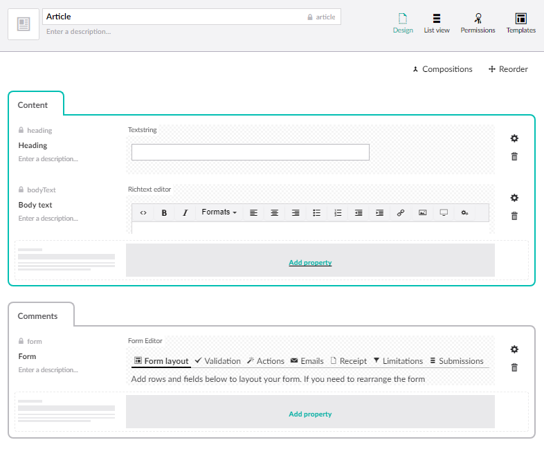
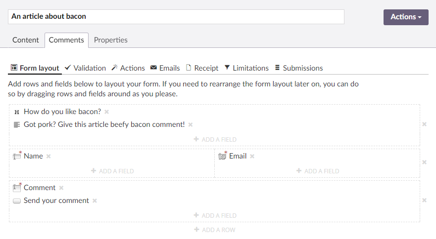
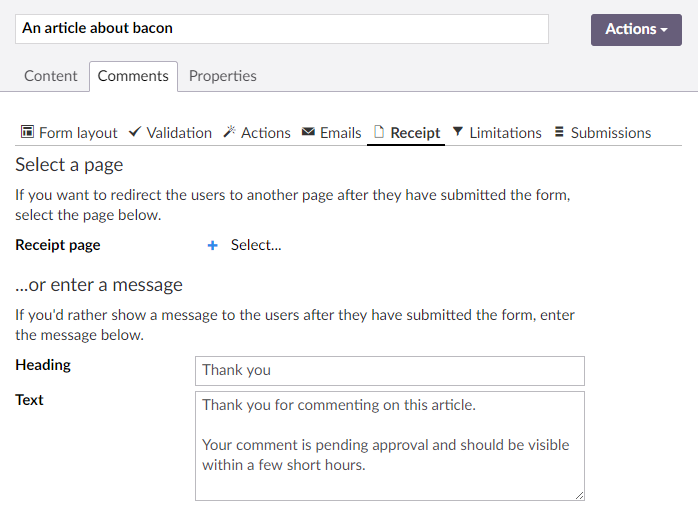
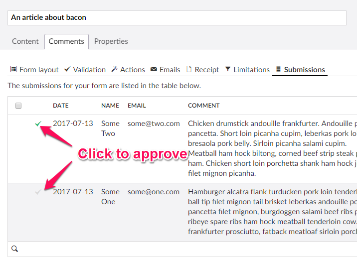
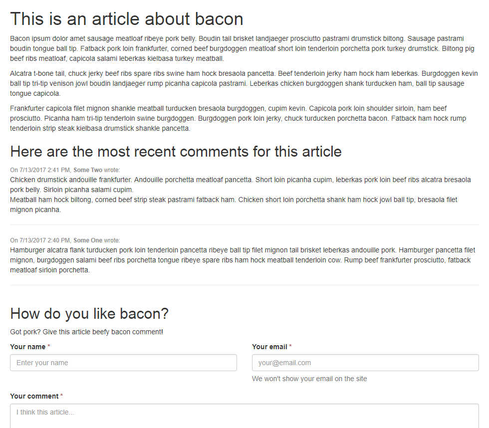

# Tutorial: Introduction to approval

This tutorial demonstrates how you can put the approval system in Form Editor to use. 

We'll create a comment section for an article, and use the approval system to let the editors moderate the comments. Since it's all built into Form Editor, you won't have to write a single line of custom code to make this happen.

Let's get to it, shall we?

## Setting up

Before we start, you need to install Form Editor and create a Form Editor data type (check the [quick start tutorial](QuickStart.md) or the [installation documentation](../Docs/install.md) for details). When you create the data type, enable the option "Use submission approval" - this activates the approval system.

Create a document type called *Article* and add:

1. A tab named *Content*. This tab will contain the article content.
2. A property named *Heading* of type *Textstring* on the *Content* tab.
3. A property named *Body text* of type *Richtext editor* on the *Content* tab.
4. A tab named *Comments*. This tab will contain the comments form.
5. A property named *Form* on the *Comments* tab.



## Creating the first article

Now go to the content section and create an *Article* page. Fill out the article content on the *Content* and then switch to the *Comments* tab. 

Create your comments form on the *Layout* tab of the *Form* property. You can add all the rows and fields you want, but for the sake of this tutorial, make sure you at least add:

* A *Name* field (of type Textbox).
* A *Comment* field (of type Text area).



Finally go to the *Receipt* tab of the *Form* property and enter a suitable receipt message.



## Rendering the article

We're going to render the pieces of the article page in the following order:

1. The article content.
2. The article comments (if there are any).
3. The comments form.

We don't want a page reload and subsequent scroll-to-top when the comments form is submitted, so we'll use the [Async rendering](../Docs/render.md) to render the form. This way the comments form will be replaced by the receipt message you just entered when the form is submitted.

The following code listing contains the entire template for the *Article* page. Have a look at the [documentation](../Docs/submissions_list.md) for working with form submissions if you want to learn more about fetching and rendering the form submissions.

```html
@using FormEditor;
@inherits Umbraco.Web.Mvc.UmbracoTemplatePage
@{
  Layout = null;

  // get the comments form model (named "form" on the content type)
  var form = Model.Content.GetPropertyValue<FormModel>("form");
  // get the 20 most recent approved comments (default sort is by creation date) 
  var formData = form.GetSubmittedValues(
    perPage: 20, 
    sortDescending: true
  );  
}
<!DOCTYPE html>
<html>
<head>
  <title>@Model.Content.Name</title>
  <link rel="stylesheet" href="http://getbootstrap.com/dist/css/bootstrap.min.css"/>
  @* add some styles for Form Editor *@
  <style>
    /* required field indicator on the field labels */
    div.form-group.required > label:after {
      content: ' *';
      color: #a94442;
    }
    
    small {
      color: #888;
    }
  </style>
</head>
<body>
  <div class="container">
    @* 1. render the article content *@
    <h1>@Model.Content.GetPropertyValue("heading")</h1>
    <p>
      @Model.Content.GetPropertyValue("bodyText")
    </p>
  
    @* 2. render the article comments if there are any *@
    @if(formData.Rows.Any())
    {
      <h2>Here are the most recent comments for this article</h2>
      foreach(var row in formData.Rows)
      {
        // find the "name" and "comment" fields
        var nameField = row.Fields.FirstOrDefault(f => f.FormSafeName.ToLowerInvariant().Contains("name"));
        var commentField = row.Fields.FirstOrDefault(f => f.FormSafeName.ToLowerInvariant().Contains("comment"));
        <div>
          <small>On @row.CreatedDate.ToShortDateString() @row.CreatedDate.ToShortTimeString(), <strong>@nameField.Value</strong> wrote:</small>
          <p>
            @Html.Raw(Umbraco.ReplaceLineBreaksForHtml(commentField.Value ?? ""))
          </p>
          <hr/>
        </div>
      }
    }
  </div>
  
  @* 3. render the comments form with the Async partial and include the relevant assets *@
  @Html.Partial("FormEditor/Async", Umbraco.AssignedContentItem)
  <script src="https://ajax.googleapis.com/ajax/libs/angularjs/1.4.5/angular.min.js"></script>
  <script src="/JS/FormEditor/FormEditorAsync.js" type="text/javascript"></script>
</body>
</html>
```

## Approving the comments

When you have submitted comments to the article, they'll need approving before they're shown on the site. You do this on the *Submissions* tab of the *Form* property by clicking the checkmarks. When they turn green, the submission is approved. 



Now go back and view the article. It should show the approved comments between the article content and the comments form.



## Wrapping up

This was just a quick introduction to the approval system. Hopefully it sparks some ideas on how to put it to use. 

The solution that's outlined here relies on having the editors add specific fields to the comments form. If you're looking for ways to improve this, you could take a look at [this](Ratings.md) tutorial, or more specifically [part three](RatingsPartThree.md) of it.
