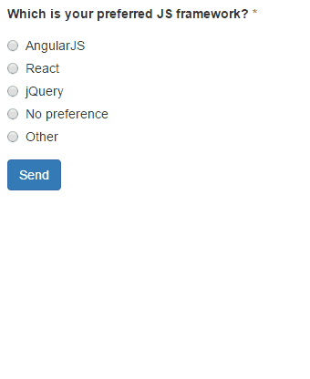
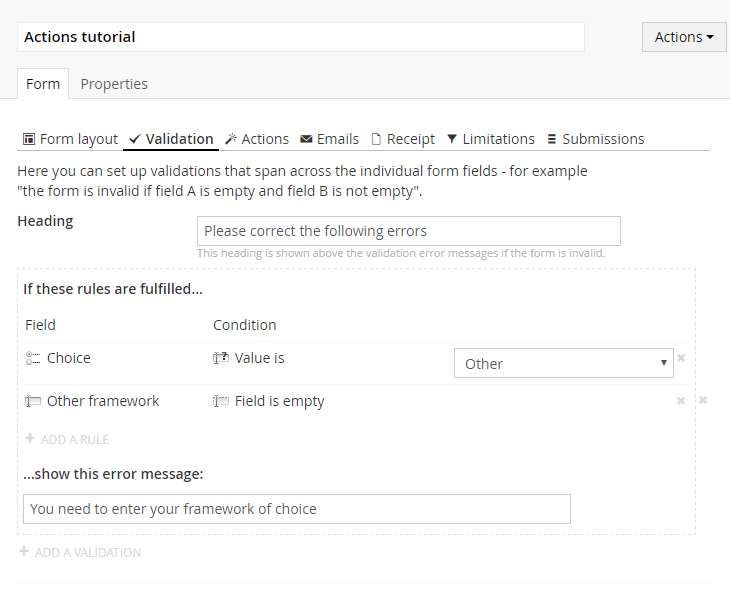

# Tutorial: Configuring a conditional field

Form Editor version 0.17 introduces the concept *Actions*, which allows the editors to conditionally show or hide fields based on a set of rules. This tutorial demonstrates a simple use case for *Actions*, and how they can be combined with cross field validations.

## Prerequisites
To follow this tutorial, you'll need:

- Form Editor version 0.17 or later installed on your site.
- The *Actions* and *Validation* tabs enabled on the Form Editor data type ([read more](../Docs/install.md#tab-order-and-availiability)).
- A document type containing a Form Editor property with the alias *form*.
- A document template based either on the [FormEditorSync](../Source/Umbraco/Views/FormEditorSync.cshtml) or the [FormEditorAsync](../Source/Umbraco/Views/FormEditorAsync.cshtml) default template ([read more](../Docs/render.md)).

## The goal
We're going to create a form that prompts the end user to add some extra information in a text box, if the value "Other" is selected in a radio button group. The form should not accept an empty value in the text box if it's shown. In other words, something in the lines of this:

## Step 1: Define the form layout
Create a page based on the document type that contains the Form Editor data type.

On the *Form layout* tab, add:
- A *Radio button group* field with some options. Make sure one of these options is "Other". If you prefer, make the field mandatory and add a suitable error message.
- A *Text box* field.
- A *Submit button* field.

## Step 2: Use *Actions* to show the text box
Switch to the *Actions* tab, add an action and set it up as follows:
- Add a rule that applies a *Value is* condition to the radio button group. Select "Other" as the value to test for.
- Select *Show* as the action to perform and select the text box field as the field to perform it on.

...and that's all it takes to make the text box field appear when "Other" is selected in the radio button group!

**Note**: Since the radio button group is a field with predefined values, Form Editor knows on beforehand which values are available to test for (clever, isn't it?) and presents these in a nice drop-down. If it had been another field type (text box, for example), the value to test for would have to be entered manually in a text box instead.

Now let's make sure the end users fill out that text box.

## Step 3: Add validation to the text box
We want to ensure that the text box is filled out if "Other" is selected in the radio button group. Enter cross field validations.

Switch to the *Validation* tab and add a validation. Then add the following two rules to the validation:

1. A rule with a *Value is* condition on the radio button group that tests for the value "Other" (exactly the same rule as we just defined on the action).
2. A rule with a *Field is empty* condition on the text box.

If both these rules are fulfilled it means that "Other" was selected in the radio button group and nothing was entered in the text box. The validation will then invalidate the form and show the error message you specify when the end user attempts to submit the form.

## And we're done!
Publish your page and give it a spin! 
