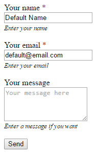

# Tutorial: Default field values
Sometimes you need to prefill some form fields with default values. With release 0.16.1.3 this has become quite easy to accomplish - here's how.

## Prerequisites
Before you start, make sure you have: 

- Form Editor version 0.16.1.3 or later installed on your site.
- A document type with a *form* property.
 
## Code, code, code
In the top of our template we'll add code to look for fields named "Name" and "Email", and set their default values if we can find them. It's important that this code is placed *before* we call the Form Editor partial view that renders the form.

You can copy this code to your own template - just remember to copy the `@using` statements too.

For simplicity we'll make do with some hard coded default values. In a real life scenario you'd probably do this a bit differently.

```xml
@using FormEditor
@using FormEditor.Rendering
@inherits Umbraco.Web.Mvc.UmbracoTemplatePage

@{
  Layout = null;
  
  // these are the default values we want to set on our form
  // - to keep things simple in this example they're just hard coded values
  var defaultName = "Default Name";
  var defaultEmail = "default@email.com";

  // get the form model
  var formModel = Model.Content.GetPropertyValue<FormModel>("form");
  // get all the value fields from the form model
  var allValueFields = formModel.AllValueFields();

  // find the "Name" field (if it's there) and set its default value if it has no submitted value
  var field = allValueFields.FirstOrDefault(f => "name".Equals(f.Name, StringComparison.OrdinalIgnoreCase));
  if(field != null && field.HasSubmittedValue == false)
  {
    field.SetSubmittedValue(defaultName, Model.Content);
  }

  // find the "Email" field (if it's there) and set its default value if it has no submitted value
  field = allValueFields.FirstOrDefault(f => "email".Equals(f.Name, StringComparison.OrdinalIgnoreCase));
  if(field != null && field.HasSubmittedValue == false)
  {
    field.SetSubmittedValue(defaultEmail, Model.Content);
  }
}

<!DOCTYPE html>
<html>
<head>
  <title>@Model.Content.Name</title>
  @* add some styles for Form Editor *@
  <style>
    /* required field indicator on the field labels */
    div.form-group.required > label:after {
      content: ' *';
      color: #a94442;
    }

    /* a little bit of form element styling to make it look a nicer */
    div.form-group {
      margin-bottom: 1em;
    }

    div.form-group label, div.form-group input, div.form-group select, div.form-group textarea {
      display: block;
    }

    div.form-group span.help-block {
      font-size: 0.8em;
      font-style: italic;
    }
  </style>
</head>
<body>
  @* render the "form" property *@
  @Html.Partial("FormEditor/NoScript", Umbraco.AssignedContentItem)
</body>
</html>
```

Now, provided we have a "Name" and an "Email" field on our form, the form will be rendered with our default values prefilled:


