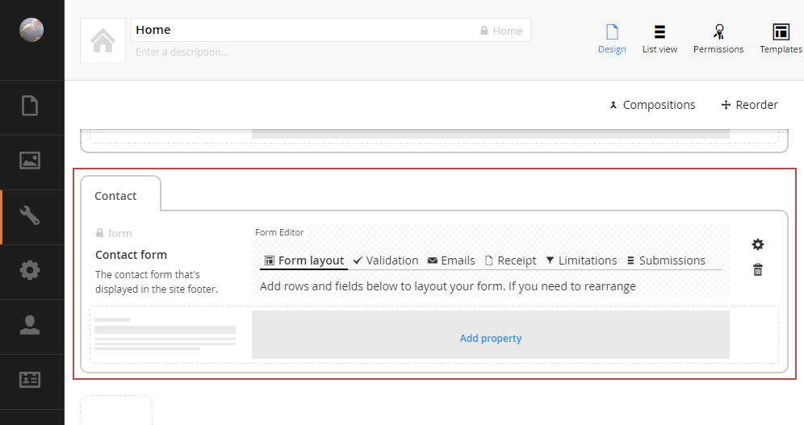
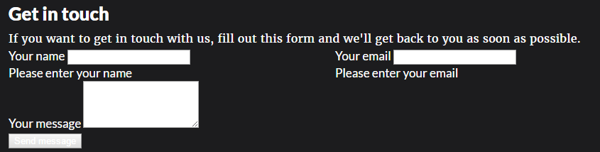
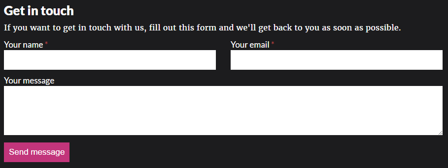

# Tutorial: Hello Form Editor
In this tutorial we'll add Form Editor to the Fanoe starter kit and create a contact form in the site footer.


## Preparation
Start by setting up a fresh Umbraco installation with the Fanoe starter kit installed. Once Umbraco is up and running, download the Umbraco package from [latest Form Editor release](https://github.com/kjac/FormEditor/releases) (it's the zip file attached to the release) and install it in the Umbraco Developer section.

## Step 1: Add Form Editor to Home
The contact form should be shown in the footer section of the site. Therefore we'll add the Form Editor property to the document type *Home*, because this document type contains all the site wide content.

First create a Form Editor data type in the Umbraco Developer section. The data type has a lot of configuration options that you should't worry about for now - just go with the default options (you can read more about the data type configuration [here](../Docs/install.md)).

Now go to the Umbraco Settings section and edit the document type *Home*. Add a *Contact* tab to the document type and add a Form Editor property to this tab. Make sure the property alias is *form*.




## Step 2: Layout the contact form
In the Umbraco Content section, edit the front page (*Home*) and open the *Contact* tab. The Form Editor property will show the *Form layout* tab by default. You can layout your form any way you like, but here's a suggestion:

1. Add a one column row with a *Heading* and a *Text paragraph* field to create an intro text.
2. Add a two column row with a *Text box* field for the user's name in the left column and an *Email address* field for the user's email in the right column. Make both fields mandatory and add suitable error messages to them.
3. Add a one column row with a *Text area* field for the user's message (optionally make it mandatory) and a *Submit button* field so the user can send the message.


When the form layout is done, switch to the *Receipt* tab of the Form Editor property and enter a thank-you message to show when the users submit the form.


## Step 3: Render the contact form
As described in the [documentation for rendering](../Docs/render.md), Form Editor supports both synchronous form postback (using [jQuery](https://jquery.com/)) and asynchronous form postback (using [AngularJS](https://angularjs.org/)). Since the contact form is going in the footer of the site, asynchronous form postback is preferable to avoid a full page reload on form submission.

The footer is rendered by the master template, so that's where we'll add the contact form rendering as well. Open */Views/Master.cshtml* and follow these steps (see also [the documentation](../Docs/render.md#1-2-3-done)).

### Render the partial view
In the ```<footer />``` element, assign the front page to ```ViewBag.FormContent``` and then render the partial view for asynchronous form postback:

```html
<footer class="field dark">
    <div class="form-editor">
        @{
          // tell Form Editor where to look for the form property
          ViewBag.FormContent = home;
          // call the Form Editor async rendering
          @Html.Partial("FormEditor/Async", Umbraco.AssignedContentItem)
        }
    </div>
    <!-- ... -->
</footer>
```

##### Why do we need to set `ViewBag.FormContent`?
Usually the Form Editor property resides on the currently requested page as any other Umbraco property, and we can just let the partial view render the form without worrying about specifying `ViewBag.FormContent`. 

In this particular case however, the Form Editor property is always located on the front page (*Home*) alongside the other site wide properties - not on the currently requested page (unless we're viewing the front page). So we need to tell the partial view where to find the Form Editor property, and we do that by assigning the front page to `ViewBag.FormContent`.

### Include AngularJS
In the bottom of the master template, include AngularJS **after** including jQuery:

```html
<script src="/js/jquery.min.js"></script>
<script src="https://ajax.googleapis.com/ajax/libs/angularjs/1.4.5/angular.min.js"></script>
```

Fortunately jQuery and AngularJS play nice together, so this will work just fine for the purpose of the tutorial. Of course for a real life site you should avoid including both if at all possible, to minimize the script load.

### Include the Form Editor JS
In the bottom of the master template, include the Form Editor JS for asynchronous form postback **after** including AngularJS:

```html
<script src="https://ajax.googleapis.com/ajax/libs/angularjs/1.4.5/angular.min.js"></script>
<script src="/JS/FormEditor/FormEditorASync.js" type="text/javascript"></script>
```

## Step 4: Finishing touches
If you view the site now and scroll down to the footer, the contact form should be visible, fully functional and look something like this:



However, some styling would help a lot. Try adding these styles:

```css
/* general styles */
input, textarea, button {
  width: 100%;
  padding: 10px;
  border: none;
  font-size: 1em;
}
input[type=checkbox], input[type=radio] {
  width: auto;
  vertical-align: baseline;
}
input[type=submit], button {
  background-color: #C2357B;
  width: auto;
}
div.hide {
  display: none;
}
div.show {
  display: block;
}

@* add some styles for AngularJS *@
[ng\:cloak], [ng-cloak], [data-ng-cloak], [x-ng-cloak], .ng-cloak, .x-ng-cloak {
  display: none !important;
}

/* add some padding the form */
div.form-editor {
  padding-bottom: 40px;
}
/* required field indicator on the field labels */
div.form-editor div.form-group.required > label:not(:empty):after {
  content: ' *';
  color: #a94442;
}
div.form-editor div.form-group.required > label:empty {
  display: none;
}
/* fanoe.css overrides all styles in the footer with white text color - we need to do something about that */
div.form-editor div.text-danger {
  color: #a94442;
}
div.form-editor input, div.form-editor textarea, div.form-editor select {
  color: #000;
}
/* add a bit of vertical spacing for fields */
div.form-editor label, div.form-editor button {
  display: block;
  margin-top: 10px;
}
/* add some padding to the receipt and validation errors containers, so they align with the form layout */
div.form-editor div.form-receipt {
  padding: 0 35px 15px 35px;
}
div.form-editor div.form-validation-errors, div.form-editor div.alert.alert-danger {
  padding: 15px;
}
/* fix the background color of the validation errors container (fanoe.css makes it rather pale) */
div.form-editor div.form-validation-errors div.alert.alert-danger {
  background-color: #a94442;
}
```

If you reload the site, the contact form should look a little better:



