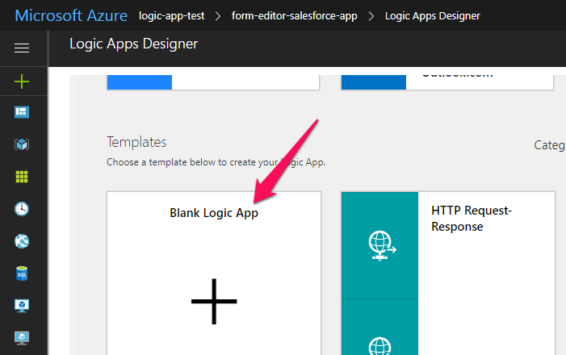
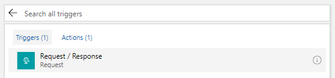
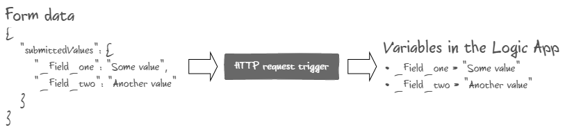
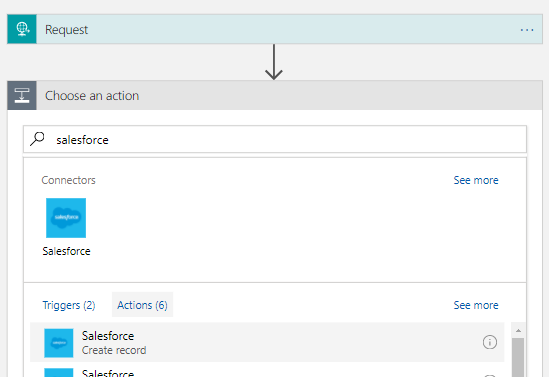
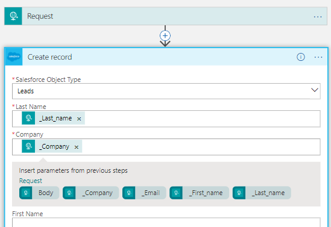
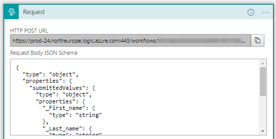
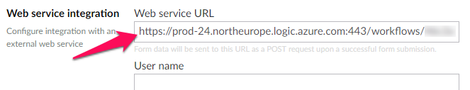
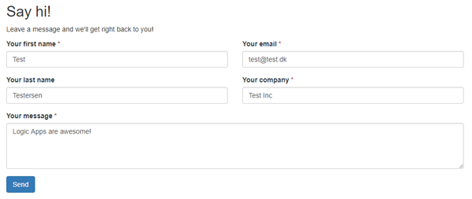
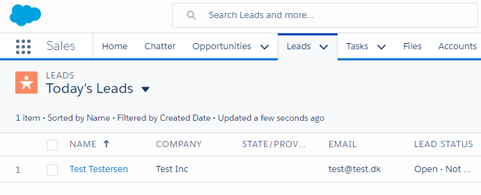

# Integrating with Azure Logic Apps

In this tutorial we're going to use [Azure Logic Apps](https://azure.microsoft.com/en-us/services/logic-apps/) to integrate Form Editor with [Salesforce CRM](https://www.salesforce.com/), all without writing a single line of code. This is accomplished by letting the built-in [web service integration](../Docs/install_web_service.md) pass each form submission to a Logic App, which in turn creates a lead in Salesforce.

We could just as easily integrate with Dynamics CRM and a [whole bunch](https://docs.microsoft.com/en-us/azure/connectors/apis-list) of other systems using Logic Apps, but since Salesforce offers a developer account for testing things like this, we'll use Salesforce in this tutorial.

## Before you start

Make sure you have Form Editor (version 1.2.1.0 or above) installed and set up. See the [quick start tutorial](QuickStart.md) or the [installation documentation](../Docs/install.md) for details. 

You'll also need accounts for Azure and Salesforce.

## What's a Logic App? 

Logic Apps are part of the Azure App Service offering from Microsoft. They are used to integrate systems in ways that would otherwise require custom development. 

A Logic App consists of:

* A trigger that invokes the app. 
* One or more actions that interact with various systems. 
* Optionally a control flow that invokes the actions based on the data available. 

Logic Apps are built using a visual designer directly in the browser (or by code). As with most other things, the look and feel of the designer changes over time, so the screenshots in this tutorial might not be exactly what you see in the designer. 

## Creating the Logic App trigger

Start off by creating a Logic App using the *Blank Logic App* template.



The trigger for our Logic App will be a *Request / Response* trigger. This trigger exposes an endpoint that runs the app when we post JSON data to it.



When setting up the trigger we can choose to specify a JSON schema for the data that's sent to it. Having a schema makes it a lot simpler to work with the data, but obviously it only works when the data conforms to a schema. In our case that means knowing part of the form layout up front, namely the form fields that we want to work with in our Logic App. 

There are [several ways](../Docs/initialize.md) to ensure that we have a known form layout, but for now let's just assume that we do. 

When Form Editor passes a form submission to a web service, the form data is offered in [two different formats](../Docs/install_web_service.md#the-data-format). Of these two, the `submittedValues` object is by far the easiest way to work with the form data within a Logic App; the properties of `submittedValues` are simply converted into corresponding variables by the trigger and made available throughout the app. 



As you'll see in a bit, a lead in Salesforce requires a last name and a company. On top of that we'll include a first name and an email. Therefore these fields make up the known part of our form layout, and thus the (minimal) expected form data that's passed to the trigger looks like this: 

```json
{
  "submittedValues": {
    "_First_name": "Test",
    "_Last_name": "Testersen",
    "_Email": "test@test.dk",
    "_Company": "Test Inc"
  }
}
```

*Note: `umbracoContentName`, `formData` and other fields are left out for brevity as we don't need them.*

*Note: The "form safe" names are used in the `submittedValues` object. If you're in doubt what that might be for a specific form field, you can always find it by inspecting the form field name in the rendered form.*

To create the JSON schema for trigger, simply copy the form data above to the *sample JSON payload* field in trigger and it'll generate the schema for us. 


## Adding the Salesforce action

Now let's put our form data to use. Add a *Salesforce - create record* action to the Logic App and connect it to your Salesforce account: 



Once connected we can use the variables defined in our JSON schema to configure the Salesforce action: 



...and that's it. Our Logic App is now ready to create leads in Salesforce whenever we pass form data to it. 

## Putting it all together 

All we need to do now is tell Form Editor to pass the submitted form data to our Logic App. This is super easy. Simply copy the *HTTP POST URL* from the trigger:



...and paste it to the *Web service URL* field in the Form Editor datatype configuration. 



If you haven't already, create a form that contains (at least) the fields required by the JSON schema:


Now when you submit the form... 



...a lead should be created in Salesforce almost instantly:



Success! 

## Closing remarks 

We've just created an integration between our Umbraco site and our CRM using only standard components and without writing a single line of code. How awesome is that? 

What's even more awesome is that we've only just scratched the surface of Logic Apps. There are lots and lots of pre-built integrations just waiting to be tapped into. 

## Troubleshooting 

Oh drat! Something isn't working? Here are a few things you can try. 

1. Test the Logic App by invoking it manually. Simply post the sample form data to the *HTTP POST URL* of the trigger using [Postman](https://www.getpostman.com/) or a similar tool. 
2. Make sure you put the *HTTP POST URL* in the correct Form Editor datatype configuration (the one being used by your form document type). 
3. Check the Umbraco log. Form Editor logs the results of all invocations of the web service integration. 


