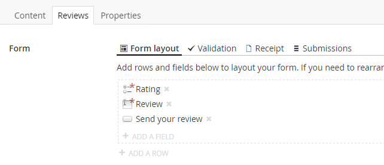
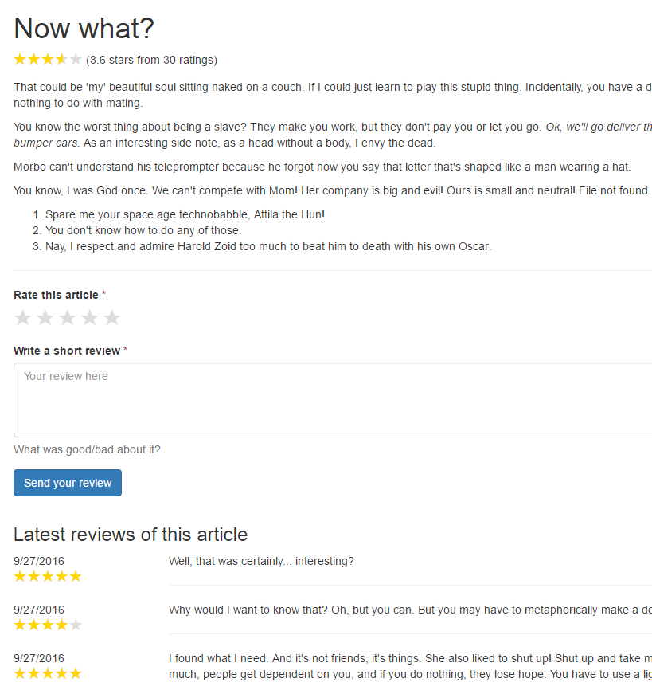

# User ratings with Form Editor
Ever needed to add end user ratings to some Umbraco content?


Form Editor makes this simple to achieve using nothing but built-in functionality, thanks to the form submission statistics feature. In this tutorial we'll create a rating system that allows the end users to rate and review articles.

## Set up Umbraco
Start with a blank Umbraco installation and install the [latest Form Editor package](https://github.com/kjac/FormEditor/releases) (it's the zip file attached to the release). 

Once the package is installed, create a Form Editor data type. There's no need to make a whole lot of changes to the default data type configuration, but at the very least you must check the "Use form statistics" box.

Finally create an *Article* document type and add:

* A *Content* tab with a *Title* property (data type *Textstring*) and a *Body text* property (data type *Richtext editor*).
* A *Reviews* tab with a *Form* property (of the newly created *Form Editor* data type).

Also, make sure the document type is allowed at root.

## Create the first article
Create an *Article* page in the Content section and add some content to it. Now switch to the *Reviews* tab and set up the form for the reviews. You can layout it any way you want, but it must include:

1. A mandatory *Radio button group* field named *Rating* with the option values "5", "4", "3", "2" and "1" (this corresponds to the number of rating stars).
2. A mandatory *Text area* field named *Review*.
3. A *Submit button* field.



## Rendering the article 
When rendering the article we need to calculate its average rating based on all the submitted ratings. We can that by using [form submission statistics](../Docs/submissions.md#how-about-statistics), since the *Radio button group* field type supports statistics out of the box.

We also need to fetch and render the latest reviews. Ideally we'd implement some pagination through all the submitted reviews, but that's for another tutorial.

The following *Article* template implements rating and review features. It is based on the default [sample template for synchronous form postback](../Source/Umbraco/Views/FormEditorSync.cshtml). All credit for the fancy CSS that turns radio buttons into clickable stars goes to the talented Lea Verou ([check out her article here](http://lea.verou.me/2011/08/accessible-star-rating-widget-with-pure-css/)).

```xml
@inherits Umbraco.Web.Mvc.UmbracoTemplatePage
@{
    Layout = null;

    // get the form model (named "form" on the content type)
    var form = Model.Content.GetPropertyValue<FormEditor.FormModel>("form");

    // get the "Rating" field
    var field = form.AllValueFields().FirstOrDefault(f => f.Name == "Rating");

    // calculate the averate rating for this article
    var averageRating = 0.0;
    var totalNumberOfRatings = 0;
    if (field != null)
    {
        // get the field value frequency statistics for the "Rating" field (if any)
        var statistics = form.GetFieldValueFrequencyStatistics(new[] { field.FormSafeName });
        var fieldValueFrequencies = statistics.FieldValueFrequencies.FirstOrDefault();
        if (fieldValueFrequencies != null)
        {
            // calculate the average rating from the field value frequencies
            averageRating = fieldValueFrequencies.Frequencies.Sum(f => double.Parse(f.Value) * f.Frequency) / statistics.TotalRows;
            totalNumberOfRatings = statistics.TotalRows;
        }
    }

    // get the last 10 reviews (at some point this should probably support pagination)
    var formData = form.GetSubmittedValues(page: 1, perPage: 10);
}
<!DOCTYPE html>
<html>
<head>
    <title>@Model.Content.Name</title>
    <link rel="stylesheet" href="http://getbootstrap.com/dist/css/bootstrap.min.css" />
    <style>
        /* styles for the required field indicator on the field labels */
        div.form-group.required > label:after {
            content: ' *';
            color: #a94442;
        }

        /* styles for average rating and rating per review */
        .stars {
            font-size: 1.5em;
            color: #ddd;
            position: relative;
            display: inline-block;
            vertical-align: middle;
            margin-top: -0.3em;
        }
        .stars .stars-fill {
            position: absolute;
            overflow: hidden;
            color: gold;
        }

        /* styles for the rating field */
        .rating-container {
            line-height: 1;
        }
        .rating {
            display: inline-block;
        }
        .rating > input {
            position: absolute;
            top: -9999px;
            clip: rect(0,0,0,0);
        }
        .rating > label {
            float: right;
            width: 1em;
            overflow: hidden;
            white-space: nowrap;
            cursor: pointer;
            font-size: 2em;
            line-height: 1;
            color: #ddd;
            margin: 0;
        }
        .rating > label:before {
            content: '★ ';
        }
        .rating > label:hover,
        .rating > label:hover ~ label,
        .rating > input:checked ~ label {
            color: gold;
        }
    </style>
</head>
<body>
    @* render the article content and its average rating *@
    <div class="container">
        <div class="row">
            <div class="cell col-md-12">
                <h1>@Model.Content.GetPropertyValue("title")</h1>
                @if (averageRating > 0)
                {
                    <div>
                        @Stars(averageRating)
                        (@Math.Round(averageRating, 1) stars from @totalNumberOfRatings ratings)
                    </div>
                }
                <p>
                    @Model.Content.GetPropertyValue("bodyText")
                </p>
                <hr />
            </div>
        </div>
    </div>

    @* render the form with the Sync partial *@
    @Html.Partial("FormEditor/Sync", Umbraco.AssignedContentItem)

    @* render the reviews *@
    @if (formData.Rows.Any())
    {
        <div class="container">
            <h3>Latest reviews of this article</h3>
            @foreach (var row in formData.Rows)
            {
                var reviewField = row.Fields.FirstOrDefault(f => f.Name == "Review");
                var ratingField = row.Fields.FirstOrDefault(f => f.Name == "Rating");
                if (reviewField != null && ratingField != null)
                {
                    <div class="row">
                        <div class="cell col-md-2">
                            @row.CreatedDate.ToShortDateString()
                            <div>
                                @Stars(double.Parse(ratingField.Value))
                            </div>
                        </div>
                        <div class="cell col-md-10">
                            @Umbraco.ReplaceLineBreaksForHtml(reviewField.Value)
                            <hr/>
                        </div>
                    </div>
                }
            }
        </div>
    }

    @* include jQuery *@
    <script src="https://code.jquery.com/jquery-2.1.4.min.js" type="text/javascript"></script>

    @* include Form Editor script for synchronous postback (using jQuery) *@
    <script src="/JS/FormEditor/FormEditorSync.js" type="text/javascript"></script>

</body>
</html>

@helper Stars(double rating)
{
    <div class="stars">
        <div class="stars-fill" style="width: @(rating * 100 / 5)%">★★★★★</div>
        ★★★★★
    </div>
}
```

### Customizing the Rating field rendering
The markup generated by the default Form Editor rendering of radio buttons is not compatible with the `rating` styles in the template above. To make it work we need to add a custom rendering for the *Rating* field.

Replace the partial view that renders the *Radio button group* field type (\Views\Partials\FormEditor\FieldsSync\core.radiobuttongroup.cshtml) with this:

```xml
@inherits Umbraco.Web.Mvc.UmbracoViewPage<FormEditor.Fields.RadioButtonGroupField>
<div class="form-group @(Model.Mandatory ? "required" : null) @(Model.Invalid ? "has-error" : null)">
  <label>@Model.Label</label>

  @* use custom rendering for "Rating" radio button group fields *@
  @if(Model.Name == "Rating")
  {
    <div class="rating-container">
      <div class="rating">
        @foreach(var fieldValue in Model.FieldValues)
        {
          <input type="radio" name="@Model.FormSafeName" value="@fieldValue.Value" @(fieldValue.Selected ? "checked" : "") @(Model.Mandatory ? "required" : null) id="star@(fieldValue.Value)" />
          <label for="star@(fieldValue.Value)" title="@fieldValue.Value">@fieldValue.Value</label>
        }
      </div>
    </div>
  }
  @* fallback to the default rendering for other radio button group fields *@
  else
  {
    foreach(var fieldValue in Model.FieldValues)
    {
      <div class="radio">
        <label>
          <input type="radio" name="@Model.FormSafeName" value="@fieldValue.Value" @(fieldValue.Selected ? "checked" : "") @(Model.Mandatory ? "required" : null) />
          @fieldValue.Value
        </label>
      </div>
    }
  }

  @Html.Partial("FormEditor/FieldsSync/core.utils.helptext")
  @Html.Partial("FormEditor/FieldsSync/core.utils.validationerror")
</div>
```

## The result
If all goes well you should have an article that looks something like this:



## Receipt page
Right now nothing really seems to happen when you submit a review for the article, because we have no receipt for the submission. We should do something about that.

Create a *Receipt* document type with a matching template, and then create a *Receipt* page in the Content section. Once done, edit the article and select the newly created *Receipt* page as *Receipt page* on the *Receipt* tab of the *Form* property.

Now when you submit a review to the article, you'll be redirected to the receipt page.

## Spam protection
You should probably consider adding spam protecting to the review form, to ensure that the article ratings are not messed up by spam robots. Remember that Form Editor [supports reCAPTCHA](../Docs/fields.md#the-recaptcha-field) out of the box.

## Alright... so what now?
This tutorial outlines a fully functional review system that could be put to use as-is. However, it could be improved on a few points.

The editorial experience is not exactly ideal, since the editors have to create the review form each time they create an article. 

Also, the rendering of the *Rating* field feels a little off, since it messes with the default radio button group rendering and involves hard coding the rating field name. 

In [Part two](RatingsPartTwo.md) of this tutorial we'll create a custom rating field to handle the rendering issue.

In the upcoming parts of this tutorial we'll address the editorial experience, and we'll also have a look at some other cool things we can do with the Form Editor extension points.