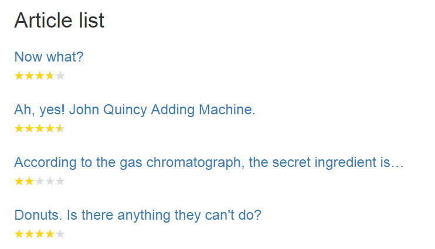

# User ratings - part four: Listing the articles
*This is a follow-up to part three of the tutorial [User ratings with Form Editor](RatingsPartThree.md).*

In this part we'll have a look at how we can use the article ratings in a list view, without having to query the form submission statistics for each article. 

## But why?
The form submission statistics are quite fast to retrieve, and they certainly work well when rendering a single article. But when it comes to listing a bunch of articles at a time, it simply won't perform well if we have to retrieve the form submission statistics for each and every article in the list. 

Fortunately we have [events](../Docs/extend.md#form-submission-events) on Form Editor that allow us to react to form submissions. We'll use these to build a database cache of the article ratings.

## First thing's first
Before we do anything, we need to add an *Article list* content type to our site. This content type should allow children of type *Article* and should be allowed at the root of the site. 

Once it's set up, create an *Article list* page in the Umbraco content tree and move all your articles below this page.

## The data layer and some plumbing
We'll build the data layer for our rating cache upon Umbraco's database abstraction `UmbracoDatabase`. 

For each article we need to store the article ID, the average rating and the number of ratings submitted, so the data model looks like this:

```cs
using Umbraco.Core.Persistence;
using Umbraco.Core.Persistence.DatabaseAnnotations;

namespace My.Models
{
	// we'll store the ratings in the table "ArticleRating"
	[TableName("ArticleRating")]
	[PrimaryKey(nameof(ArticleId), autoIncrement = false)]
	public class ArticleRating
	{
		// we'll use the article ID as primary key, so no auto increment
		[PrimaryKeyColumn(AutoIncrement = false)]
		public int ArticleId { get; set; }

		public double AverageRating { get; set; }

		public int TotalNumberOfRatings { get; set; }
	}
}
```

To handle data access we'll simply create a set of extensions for `UmbracoDatabase`:

```cs
using System.Collections.Generic;
using My.Models;
using Umbraco.Core.Persistence;

namespace My.Extensions
{
	public static class UmbracoDatabaseExtensions
	{
		public static ArticleRating GetArticleRating(this UmbracoDatabase umbracoDatabase, int articleId)
		{
			return umbracoDatabase.SingleOrDefault<ArticleRating>(articleId);
		}

		public static IEnumerable<ArticleRating> GetArticleRatings(this UmbracoDatabase umbracoDatabase, IEnumerable<int> articleIds)
		{
			return umbracoDatabase.Query<ArticleRating>($"WHERE {nameof(ArticleRating.ArticleId)} IN (@0)", articleIds);
		}

		public static void AddArticleRating(this UmbracoDatabase umbracoDatabase, int articleId, double averageRating, int totalNumberOfRatings)
		{
			if (umbracoDatabase.Exists<ArticleRating>(articleId))
			{
				umbracoDatabase.Update(new ArticleRating { ArticleId = articleId, AverageRating = averageRating, TotalNumberOfRatings = totalNumberOfRatings });
			}
			else
			{
				umbracoDatabase.Insert(new ArticleRating { ArticleId = articleId, AverageRating = averageRating, TotalNumberOfRatings = totalNumberOfRatings });
			}
		}

		public static void DeleteArticleRating(this UmbracoDatabase umbracoDatabase, int articleId)
		{
			umbracoDatabase.Delete<ArticleRating>(articleId);
		}
	}
}
```

...and to provide easy access to the rating cache from our views, we'll add a couple of extension methods to `UmbracoHelper` as well:

```cs
using System.Collections.Generic;
using System.Linq;
using My.Models;
using Umbraco.Core.Models;
using Umbraco.Web;

namespace My.Extensions
{
	public static class UmbracoHelperExtensions
	{
		public static ArticleRating GetArticleRating(this UmbracoHelper umbracoHelper, IPublishedContent article)
		{
			return umbracoHelper.UmbracoContext.Application.DatabaseContext.Database.GetArticleRating(article.Id) ?? new ArticleRating(); 
		}

		public static IEnumerable<ArticleRating> GetArticleRatings(this UmbracoHelper umbracoHelper, IEnumerable<IPublishedContent> articles)
		{
			return umbracoHelper.UmbracoContext.Application.DatabaseContext.Database.GetArticleRatings(articles.Select(a => a.Id));
		}
	}
}
```

The last bit of plumbing we need is something to create the *ArticleRating* table. We'll add an `ApplicationEventHandler` to handle this when the application starts:

```cs
using My.Models;
using Umbraco.Core;
using Umbraco.Core.Persistence;

namespace My.Events
{
	public class ArticleRatingCacheEventHandler : ApplicationEventHandler
	{
		protected override void ApplicationStarted(UmbracoApplicationBase umbracoApplication, ApplicationContext applicationContext)
		{
			// automatically create the tables for the article ratings on app start
			var dbContext = applicationContext.DatabaseContext;
			var db = new DatabaseSchemaHelper(dbContext.Database, applicationContext.ProfilingLogger.Logger, dbContext.SqlSyntax);
			if (db.TableExist(nameof(ArticleRating)) == false)
			{
				db.CreateTable<ArticleRating>(false);
			}

			// ...more to come here...
		}
	}
}
```

Now that we've got the data layer in place, let's start implementing!

## Caching the article ratings
We need to add or update the rating cache for an article whenever the end users submit a review - in other words, whenever Form Editor adds a submission to the article storage index. As it happens to be, there's an event for that: `FormModel.AfterAddToIndex`. 

The editors can delete reviews for an article from the list of submitted reviews in backend, and thus affect the article rating. Unfortunately there's no event that lets us act on this, so we'll do the next best thing: We'll update the rating cache when the article is published (the editors will just have to republish the article after deleting reviews).

Lastly we also need to clean up the rating cache when an article is deleted from Umbraco.

We'll handle all of the above in the `ArticleRatingCacheEventHandler`, so the final implementation looks like this:

```cs
using System.Linq;
using FormEditor;
using FormEditor.Events;
using My.Extensions;
using My.Models;
using Umbraco.Core;
using Umbraco.Core.Events;
using Umbraco.Core.Models;
using Umbraco.Core.Persistence;
using Umbraco.Core.Publishing;
using Umbraco.Core.Services;
using Umbraco.Web;

namespace My.Events
{
	public class ArticleRatingCacheEventHandler : ApplicationEventHandler
	{
		protected override void ApplicationStarted(UmbracoApplicationBase umbracoApplication, ApplicationContext applicationContext)
		{
			// automatically create the tables for the article ratings on app start
			var dbContext = applicationContext.DatabaseContext;
			var db = new DatabaseSchemaHelper(dbContext.Database, applicationContext.ProfilingLogger.Logger, dbContext.SqlSyntax);
			if (db.TableExist(nameof(ArticleRating)) == false)
			{
				db.CreateTable<ArticleRating>(false);
			}

			// add handlers for updating the article rating cache
			FormModel.AfterAddToIndex += FormModelOnAfterAddToIndex;
			ContentService.Published += ContentServiceOnPublished;

			// add handler to clean up the article rating cache
			ContentService.Deleted += ContentServiceOnDeleted;
		}

		private void FormModelOnAfterAddToIndex(FormModel sender, FormEditorEventArgs formEditorEventArgs)
		{
			// when submitting a form to content of type "article", calculate and save the ratings to the database
			if (formEditorEventArgs.Content.DocumentTypeAlias == "article")
			{
				CalculateAndSaveArticleRating(sender, formEditorEventArgs.Content);
			}
		}

		private void ContentServiceOnPublished(IPublishingStrategy sender, PublishEventArgs<IContent> publishEventArgs)
		{
			// when publishing a form to content of type "article", calculate and save the ratings to the database
			// - this allows the editors to moderate the reviews, as long as they remember to hit "save and publish" afterwards
			foreach (var publishedEntity in publishEventArgs.PublishedEntities)
			{
				if (publishedEntity.ContentType.Alias == "article")
				{
					// get the published content and its form property (if it exists)
					var article = UmbracoContext.Current.ContentCache.GetById(publishedEntity.Id);
					var form = article?.GetPropertyValue<FormModel>("form");
					if (form != null)
					{
						CalculateAndSaveArticleRating(form, article);
					}
				}
			}
		}

		private void CalculateAndSaveArticleRating(FormModel form, IPublishedContent article)
		{
			// get the "Rating" field
			var field = form.AllValueFields().FirstOrDefault(f => f.Name == "Rating");

			// calculate the averate rating for this article
			if (field != null)
			{
				// get the field value frequency statistics for the "Rating" field (if any)
				var statistics = form.GetFieldValueFrequencyStatistics(article, new[] { field.FormSafeName });
				var fieldValueFrequencies = statistics?.FieldValueFrequencies.FirstOrDefault();
				if (fieldValueFrequencies != null)
				{
					// calculate the average rating from the field value frequencies
					var averageRating = fieldValueFrequencies.Frequencies.Sum(f => double.Parse(f.Value) * f.Frequency) / statistics.TotalRows;
					var totalNumberOfRatings = statistics.TotalRows;

					// save the average rating and the total number of ratings to the database
					UmbracoContext.Current.Application.DatabaseContext.Database.AddArticleRating(article.Id, averageRating, totalNumberOfRatings);
				}
			}
		}

		private void ContentServiceOnDeleted(IContentService sender, DeleteEventArgs<IContent> deleteEventArgs)
		{
			foreach (var deletedEntity in deleteEventArgs.DeletedEntities)
			{
				// when deleting content of type "article", delete the calculated ratings from the database
				if (deletedEntity.ContentType.Alias == "article")
				{
					UmbracoContext.Current.Application.DatabaseContext.Database.DeleteArticleRating(deletedEntity.Id);
				}
			}
		}
	}
}
```

Notice how the rating calculation in `CalculateAndSaveArticleRating()` more or less is a copy of what we do in the *Article* template.

When you've got all this working, you'll have to populate the rating cache for each of your articles, either by submitting a new review to them or by republishing them. 

## Rendering the article list
With our rating cache in place, it's time to put it to use!

The *Article list* template will simply list all *Article* children of the current page, and print the title and of course the rating of each article. Not very elaborate, but surely you can expand on it later.

Here's the full *Article list* template. 

```xml
@using My.Extensions
@inherits Umbraco.Web.Mvc.UmbracoTemplatePage
@{
    // NOTE:
    // the stars CSS and helper method are duplicated from the article template for simplicity. 
    // you should extract them and put them elsewhere in a real life implementation.

    Layout = null;

    var articles = Model.Content.Children.Where(c => c.DocumentTypeAlias == "article").ToArray();
    var ratings = Umbraco.GetArticleRatings(articles);
}

<!DOCTYPE html>
<html>
<head>
    <title>@Model.Content.Name</title>
    <link rel="stylesheet" href="http://getbootstrap.com/dist/css/bootstrap.min.css"/>

    <style>
        /* styles for average rating and rating per review */
        .stars {
            font-size: 1.5em;
            color: #ddd;
            position: relative;
            display: inline-block;
            vertical-align: middle;
            margin-top: -0.3em;
        }

        .stars .stars-fill {
            position: absolute;
            overflow: hidden;
            color: gold;
        }
    </style>
</head>
<body>
<div class="container">
    <h1>Article list</h1>
    @foreach (var article in articles)
    {
        // get the rating for this article (if there is any available)
        var rating = ratings.FirstOrDefault(r => r.ArticleId == article.Id);
        <div class="row">
            <div class="cell col-md-12">
                <h3>
                    <a href="@article.Url">@article.GetPropertyValue("title")</a>
                </h3>
                @if (rating != null && rating.AverageRating > 0)
                {
                    @Stars(rating.AverageRating)
                }
                @* 
                    you should probably add a teaser text to the article content type and 
                    render it here, e.g @article.GetPropertyValue("teaser") 
                *@
            </div>
        </div>
    }
</div>
</body>
</html>

@helper Stars(double rating)
{
    <div class="stars">
        <div class="stars-fill" style="width: @(rating * 100 / 5)%">★★★★★</div>
        ★★★★★
    </div>
}
```

If everything went according to plan, you should end up with something like this:



## Updating the article rendering
Remember how we copied the rating calculation from the *Article* template into our rating cache event handler? We really don't want that code floating around in the template too, and besides we might as well utilize our cache when rendering the article itself. So let's replace the whole rating calculation the *Article* template with this:

```cs
// get the averate rating for this article
var articleRating = Umbraco.GetArticleRating(Model.Content);
var averageRating = 0.0;
var totalNumberOfRatings = 0;
if(articleRating != null && articleRating.AverageRating > 0) {
  averageRating = articleRating.AverageRating
  totalNumberOfRatings = articleRating.TotalNumberOfRatings
}
```

The rest of the *Article* template shouldn't need any updating, as we're reusing the old variable names for the rating data.

## Conclusion
At long last we're done with our rating system! Hooray!! You may still need to clean up and refactor a few bits for reuse here and there, but you have a solid foundation rolling your out own rating system.

This tutorial should give you an idea of just how versatile Form Editor really is, despite it being just another property editor. Hopefully it will serve as an inspiration to use Form Editor for more than just contact forms :)

Happy coding!