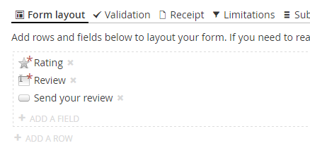

# User ratings - part two: Custom rating field
*This is a follow-up to the tutorial [User ratings with Form Editor](Ratings.md).*

In this part we'll create a custom field for the rating stars, which will improve the implementation of the rating system in two ways:

- The editors will have an easier time creating the review form with a dedicated field for the rating stars.
- We'll get our own partial view for rendering the stars, and thus we can undo the changes we made to the *Radio button group* partial view in the previous part.



A custom field can be [created](../Docs/extend_field.md) in two ways: The simple (by configuration) and the advanced (by code). In the following we'll go through both ways. As we do, keep in mind that we're rendering for synchronous form postback, as this will be reflected in the partial views.

If you're not interrested in the simple way of creating fields, [click here](#the-advanced-way-by-code-visual-studio-required) to skip to the advanced way.

## The simple way (by configuration, Visual Studio not required)
All fields have a *type*, which is key to how Form Editor works with the different fields. Our custom field will have the type *my.rating.simple*. As we move through the implementation of the field, notice how we use the field type for naming the field assets.

### Step 1: Register the field
Start by registering the field in `FormEditor.config`. It needs to support multiple field values and field value statistics, both of which the *fixedValues* option will give us:

```xml
<?xml version="1.0" encoding="utf-8"?>
<FormEditor>
  <!-- add your custom fields here -->
  <CustomFields>
    <Field type="my.rating.simple" name="Rating" fixedValues="true" />
  </CustomFields>

  <!-- ... -->
</FormEditor>
```

### Step 2: Add the field icon
Download the icon below and save it to */App_Plugins/FormEditor/editor/fields/*.


### Step 3: Add the field partial view
Create the following partial view as */Views/Partials/FormEditor/FieldsSync/my.rating.simple.cshtml*:

```xml
@inherits Umbraco.Web.Mvc.UmbracoViewPage<FormEditor.Fields.CustomFieldFixedValues>
<div class="form-group @(Model.Mandatory ? "required" : null) @(Model.Invalid ? "has-error" : null)">
  <label>@Model.Label</label>
  <div class="rating-container">
    <div class="rating">
      @foreach(var fieldValue in Model.FieldValues)
      {
        // use the umbraco dictionary to fetch the title for this star - fall back to "X stars"
        var title = Umbraco.Coalesce(Umbraco.GetDictionaryValue("Rating." + fieldValue.Value), fieldValue.Value + " stars");
        <input type="radio" name="@Model.FormSafeName" value="@fieldValue.Value" @(fieldValue.Selected ? "checked" : "") @(Model.Mandatory ? "required" : null) id="star@(fieldValue.Value)" />
        <label for="star@(fieldValue.Value)" title="@title">@title</label>
      }
    </div>
  </div>

  @Html.Partial("FormEditor/FieldsSync/core.utils.helptext")
  @Html.Partial("FormEditor/FieldsSync/core.utils.validationerror")
</div>
```

### Step 4: Use the field
That's it! Now we can use the field in our review form: 

- Edit the *Article* page and switch to the *Reviews* tab. 
- Replace the *Rating* field with the new custom field and add the same option values as before ("5", "4", "3", "2" and "1"). 
- Hit *Save and publish* and view the page in frontend. 

**Note:** If the field doesn't appear in the list of available fields, you probably have to either:

- Restart the site to make Umbraco pick up the configuration changes.
- Add the field to a field type group (if you have set up field type groups on the Form Editor data type).

If you're not interested in the Visual Studio way of creating fields, [scroll down to the bottom](#closing-remarks) now :)

## The advanced way (by code, Visual Studio required)
All fields have a *type*, which is key to how Form Editor works with the different fields. Our custom field will have the type *my.rating.advanced*. As we move through the implementation of the field, notice how we use the field type for naming the field assets.

### Step 1: Implement the field
First and foremost let's set up a project that can contain the field implementation:

- If you're running Umbraco as a Web Application project in Visual Studio, you already have a project and you're good to go. 
- If you're not, create a class library project in Visual Studio and make sure the output DLL (and *only* the output DLL - [here's why](../Docs/extend_field_advanced.md#project-output)) is copied to the */bin/* folder of the site.

Add the applicable version of the [Form Editor Binaries](https://www.nuget.org/packages/FormEditor.Binaries/) NuGet package to your project.

Now add the following class to your project:

```cs
using System.Linq;
using FormEditor.Fields;

namespace My.Fields
{
	public class RatingField : FieldWithFieldValues
	{
		public RatingField() : base()
		{
			FieldValues = Enumerable.Range(1, 5)
				.Select(value => new FieldValue { Value = value.ToString(), Selected = false })
				.Reverse()
				.ToArray();

			Mandatory = true;
		}

		public override string Type => "my.rating.advanced";

		public override string PrettyName => "Rating";

		public override bool MultipleValuesPerEntry => false;

		public override bool IsMultiSelectEnabled => false;
	}
}
```

A few things are worth noticing here:

- The field inherits `FieldWithFieldValues`, which gives us both multiple field values and field value statistics.
- The constructor initializes the field values with the values required to render the five stars ("5", "4", "3", "2" and "1").
- The `Type` property must return the field type - in this case *my.rating.advanced*.
- `MultipleValuesPerEntry` is set to `false` to tell the form submission statistics that each submission of the field can only yield one value in the statistics. This is primarily used when displaying the form submission statistics in backend.

### Step 2: Add the field icon
Download the icon below and save it to */App_Plugins/FormEditor/editor/fields/*.


### Step 3: Add the field editor
Advanced fields implement their own field editors in the backend, to let the editors work with the field properties.

The rating field is essentially identical to the *Radio button group* field, so we'll use this field editor as a starting point (*/App_Plugins/FormEditor/editor/fields/core.radiobuttongroup.html*). In our case however it makes sense to limit the editors, so they don't:

- Rename the field - we need it to be "Rating" when rendering the article (the field name will default to the value of `PrettyName`). 
- Change the field values, which need to be exactly as they are initialized by the field constructor.

With these limitations in mind, the final field editor looks like this:

```xml
<div class="umb-panel form-editor-edit-field" ng-controller="FormEditor.Editor.FieldController">
  <div class="umb-panel-body no-header with-footer umb-scrollable" ng-init="dialogData.field.multiSelect = false">
    <div class="umb-control-group">
      <div class="tab-content form umb-el-wrap">
        <form-editor-field-header></form-editor-field-header>

        <div class="umb-pane">
          <!--
            the label and help text editing were extracted from the <form-editor-field-basics> directive.
            if you're curious, the directive is implemented in /App_Plugins/FormEditor/editor/form.html.
          -->
          <label class="control-label" for="label">
            <form-editor-localize key="edit.label">Label</form-editor-localize>
            <small form-editor-localize key="edit.label.helpText">The field label shown to the users</small>
          </label>
          <input type="text" id="label" ng-model="dialogData.field.label" />

          <label class="control-label" for="helpText">
            <form-editor-localize key="edit.helpText">Help text</form-editor-localize>
            <small form-editor-localize key="edit.helpText.helpText">Explanatory text to help the users</small>
          </label>
          <input type="text" id="helpText" ng-model="dialogData.field.helpText"/>

          <form-editor-field-error-message></form-editor-field-error-message>
        </div>
      </div>
    </div>
  </div>

  <form-editor-field-footer></form-editor-field-footer>
</div>
```

Save this field editor to */App_Plugins/FormEditor/editor/fields/my.rating.advanced.html*.

### Step 4: Add the field rendering
Create the following partial view as */Views/Partials/FormEditor/FieldsSync/my.rating.advanced.cshtml*:

```xml
@inherits Umbraco.Web.Mvc.UmbracoViewPage<My.Fields.RatingField>
<div class="form-group @(Model.Mandatory ? "required" : null) @(Model.Invalid ? "has-error" : null)">
  <label>@Model.Label</label>
  <div class="rating-container">
    <div class="rating">
      @foreach(var fieldValue in Model.FieldValues)
      {
        // use the umbraco dictionary to fetch the title for this star - fall back to "X stars"
        var title = Umbraco.Coalesce(Umbraco.GetDictionaryValue("Rating." + fieldValue.Value), fieldValue.Value + " stars");
        <input type="radio" name="@Model.FormSafeName" value="@fieldValue.Value" @(fieldValue.Selected ? "checked" : "") @(Model.Mandatory ? "required" : null) id="star@(fieldValue.Value)" />
        <label for="star@(fieldValue.Value)" title="@title">@title</label>
      }
    </div>
  </div>

  @Html.Partial("FormEditor/FieldsSync/core.utils.helptext")
  @Html.Partial("FormEditor/FieldsSync/core.utils.validationerror")
</div>
```

This view is identical with the one created for the simple field, with the exception of the view model type.

### Step 5: Use the field
That's it! Now we can use the field in our review form: 

- Edit the *Article* page and switch to the *Reviews* tab. 
- Replace the *Rating* field with the new custom field (take a moment to enjoy how nice and simple the configuration is, compared to using the Radio button group field). 
- Hit *Save and publish* and view the page in frontend. 

**Note:** If the field doesn't appear in the list of available fields, you have probably set up field type groups on the Form Editor data type. In that case you'll have to add the field to a group before you can use it.

## Closing remarks
If everything goes as planned, the page shouldn't look any different in frontend. But behind the scenes we've got a better implementation with less risk of configuration errors (especially if you went the Visual Studio way).

Since our custom field is set up with the same field values as we did the radio buttons in part one, the field value statistics that we already gathered for our article are automatically adapted by the custom field.

You can go ahead and undo the changes made to the *Radio button group* rendering - if you didn't make a backup you can find the original [here](../Source/Umbraco/Views/Partials/FormEditor/FieldsSync/core.radiobuttongroup.cshtml).

Are you up for more? The go to [part three](RatingsPartThree.md) of this tutorial and have a look at how we can automate some of the editor workload.
