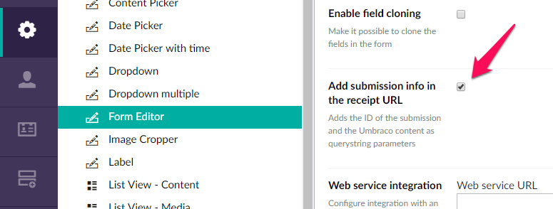
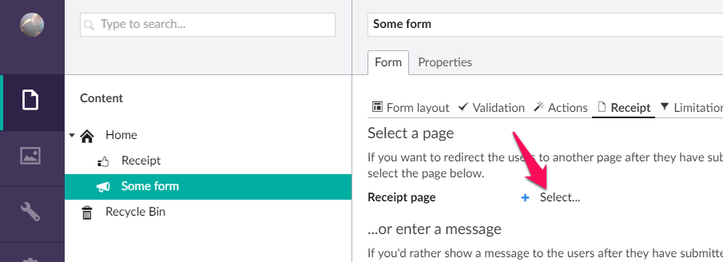
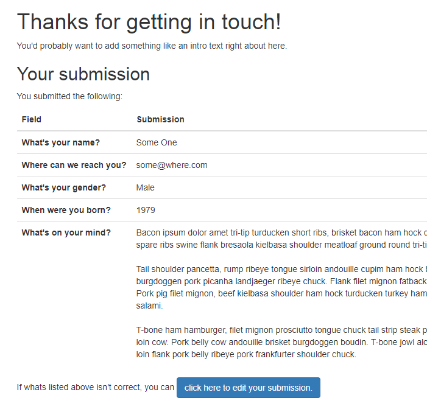
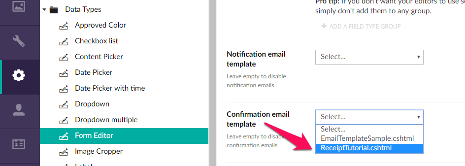
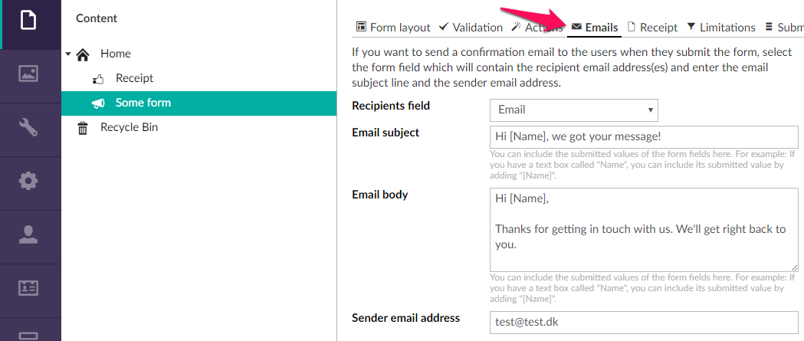
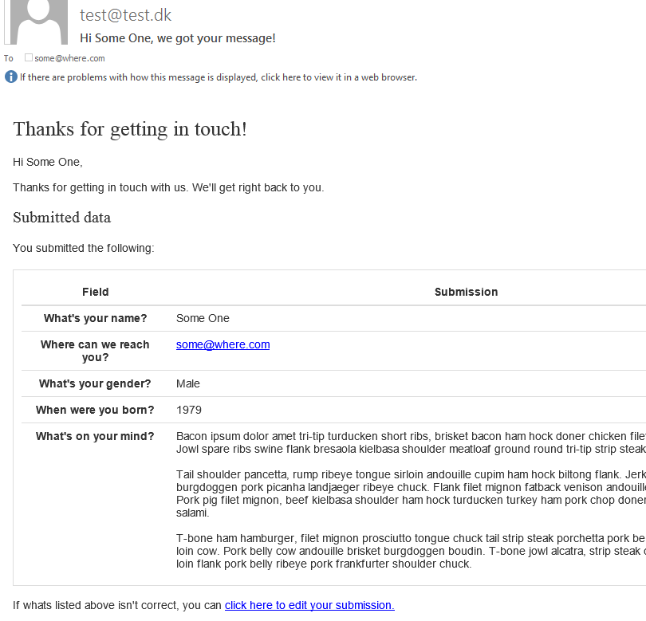

# Tutorial: Advanced receipts

With Form Editor, the receipt page is whatever Umbraco page you pick on the *Receipt* tab. Therefore we can put all sorts of things into the receipt page rendering.

In this tutorial we're going to show the submitted data on the receipt page, and subsequently give the users an option to edit their submitted data. Once that works, we'll apply the same solution to the receipt email.

## Preparation

First and foremost of course you need Form Editor installed and set up (check the [quick start tutorial](QuickStart.md) or the [installation documentation](../Docs/install.md) for details). 

Once that's set up, you need to enable the option "Add submission info in the receipt URL" on the Form Editor data type. This option was introduced in version 1.1.1.0, so if you don't see it, you need to upgrade your Form Editor version.



You also need to create a document type for the receipt page - let's simply call it *Receipt*. You don't need to add any properties to the document type, we won't be needing any for this tutorial. 

Finally let's create some content for testing. You'll need:

* A *Receipt* page.
* A *Form Editor* page with some form fields added to the *Layout* tab of the *Form* property, and the *Receipt* page selected as receipt page on the *Receipt* tab. 



## The receipt page

In order to show the form submission on the receipt page, the page template needs to pick up the ID of the submission and ID of the page on which the form resides (remember: the form submissions belong to the Form Editor property, which in turn belongs to the page). With these two IDs you can load the Form Editor property from the form page, and in turn load the form submission data into the Form Editor property - like this:

```cs
FormModel form = null;
IPublishedContent content = null;

// the IDs of the submission and the Umbraco content that contains the form 
// are passed in the query string parameters "sid" and "cid" respectively
Guid submissionId;
int contentId;
if(Guid.TryParse(Request.QueryString["sid"], out submissionId) && int.TryParse(Request.QueryString["cid"], out contentId)) {
  content = Umbraco.TypedContent(contentId);
  if(content != null) {
    form = content.GetPropertyValue<FormModel>("form");
    if(form != null) {
      form.LoadValues(content, submissionId);
    }
  }
}
```

With the form submission data loaded, you can loop the value fields of the form and render their submitted values - like this:

```html
@foreach (var field in form.AllValueFields())
{
  // attempt to get the field label from the field if applicable (default to the field name)
  var label = field.LabelOrName();
  <tr>
    <th>@label</th>
    <td>@Html.Raw(field.SubmittedValueForEmail())</td>
  </tr>
}
```

Finally you can add a link back to the form page with the submission ID in the query string, which will let the users edit their submission (it'll be put to use in the next section) - like this:

```html
<a href="@content.Url?sid=@submissionId" class="btn btn-primary">click here to edit your submission.</a>
```

The following code listing contains the full *Receipt* template with all of the above included:

```html
@using FormEditor;
@using FormEditor.Fields;
@using FormEditor.Rendering;
@inherits Umbraco.Web.Mvc.UmbracoTemplatePage
@{
  Layout = null;

  FormModel form = null;
  IPublishedContent content = null;
  
  // the IDs of the submission and the Umbraco content that contains the form 
  // are passed in the query string parameters "sid" and "cid" respectively
  Guid submissionId;
  int contentId;
  if(Guid.TryParse(Request.QueryString["sid"], out submissionId) && int.TryParse(Request.QueryString["cid"], out contentId)) {
    content = Umbraco.TypedContent(contentId);
    if(content != null) {
      form = content.GetPropertyValue<FormModel>("form");
      if(form != null) {
        form.LoadValues(content, submissionId);
      }
    }
  }
}
<!DOCTYPE html>
<html>
<head>
  <title>Receipt</title>
  <link rel="stylesheet" href="http://getbootstrap.com/dist/css/bootstrap.min.css"/>
</head>
<body>
  <div class="container">
    <h1>Thanks for getting in touch!</h1>
    <p>
      You'll probably want to add something like an intro text right about here. 
    </p>
    @* 
      render the submitted data - for the sake of this tutorial we're just going to loop through the fields 
      and render their names and values using the "for email" representation of the field values
    *@
    @if(form != null) {
      <h2>Your submission</h2>
      <p>
        You submitted the following:
      </p>
      <div class="data-container">
        <table class="table">
          <thead>
            <tr>
              <th width="20%">Field</th>
              <th>Submission</th>
            </tr>
          </thead>
          <tbody>
            @foreach (var field in form.AllValueFields())
            {
              // attempt to get the field label from the field if applicable (default to the field name)
              var label = field.LabelOrName();
              <tr>
                <th>@label</th>
                <td>@Html.Raw(field.SubmittedValueForEmail())</td>
              </tr>
            }
          </tbody>
        </table>
      </div>
      <div>
        If whats listed above isn't correct, you can 
        <a href="@content.Url?sid=@submissionId" class="btn btn-primary">click here to edit your submission.</a>
      </div>
    }
  </div>
</body>
</html>
```

...it should come out something like this:



## The form page

When the users click the link on the receipt page, you need to grab the ID of the submission from the query string, and load the submitted data into the Form Editor property, so the users can edit their submission. Fortunately this is super easy:

```cs
// load the submission data if the ID of a submission is passed in the query string 
ViewBag.FormRowId = Request.QueryString["sid"];
```

The following code listing contains the full *Form Editor* template with this enabled (based on the [NoScript](../Docs/render.md) rendering):

```html
@inherits Umbraco.Web.Mvc.UmbracoTemplatePage
@{
  Layout = null;
  
  // load the submission data if the ID of a submission is passed in the query string
  ViewBag.FormRowId = Request.QueryString["sid"];
}
<!DOCTYPE html>
<html>
<head>
  <title>@Model.Content.Name</title>
  <link rel="stylesheet" href="http://getbootstrap.com/dist/css/bootstrap.min.css"/>
  @* add some styles for Form Editor *@
  <style>
    /* required field indicator on the field labels */
    div.form-group.required > label:after {
      content: ' *';
      color: #a94442;
    }
  </style>
</head>
<body>
  <div class="container">
    <h1>Get in touch with us!</h1>
    <p>
      You'll probably want to add something like an intro text right about here. 
    </p>
  </div>
  @* render the Form Editor property with the NoScript rendering *@
  @Html.Partial("FormEditor/NoScript", Umbraco.AssignedContentItem)  
</body>
</html>
```

And voila - you've just given your users an option to review and fix any errors they made when submitting the form. Easy, right?

Let's get on with the receipt email then!

## The receipt email

You can apply almost the same implementation to the receipt email as you did to the receipt page. If you're unfamiliar with Form Editor email templates, you can read about them [here](../Docs/emails.md).

Start by creating a copy of the sample email template *EmailTemplateSample.cshtml* in */Views/Partials/FormEditor/Email/* and rename it to *ReceiptTutorial.cshtml*. 

Now select *ReceiptTutorial.cshtml* as confirmation email template in the Form Editor data type.



Edit the form page. A tab named *Emails* will now be available, because you have set up the confirmation email template. Fill out the fields on the *Emails* tab and publish the form page.



Finally replace the contents of *ReceiptTutorial.cshtml* with the following code listing. The code should look very familiar, as it's almost a duplicate of the receipt page template. However, bear in mind that the view model for a Form Editor email template is the Form Editor property with the submitted data preloaded.

```html
@using FormEditor;
@using FormEditor.Fields;
@using FormEditor.Rendering;
@inherits Umbraco.Web.Mvc.UmbracoViewPage<FormModel>
@{
  // the current content item is passed to the view as ViewData["currentContent"]
  // - Umbraco.AssignedContentItem doesn't in this context
  var currentContent = ViewData["currentContent"] as IPublishedContent;
}
<!DOCTYPE html>
<html>
<head>
  <title>Receipt</title>
  <style>
    body {
      font-family: Helvetica, Arial, sans-serif;
      font-size: 14px;
      line-height: 1.42857143;
      color: #333;
      background-color: #fff;
    }

    h1, h2 {
      font-family: inherit;
      font-weight: 500;
      line-height: 1.1;
      font-size: 26px;
    }

    h2 {
      font-size: 20px;
    }

    table {
      border-spacing: 0;
      border-collapse: collapse;
    }

    th, td {
      padding: 8px;
      line-height: 1.42857143;
      vertical-align: top;
      border-top: 1px solid #ddd;
    }

    thead th {
      border-top: 0;
      border-bottom: 2px solid #ddd;
    }

    .data-container {
      border: 1px solid #ddd;
      border-radius: 4px;
      padding: 10px;
      display: inline-block;
    }
  </style>
</head>
<body>
  <h1>Thanks for getting in touch!</h1>
  <p>
    @* add the interpolated confirmation email body text *@
    @Model.GetEmailConfirmationBodyText()
  </p>
  <h2>Submitted data</h2>
  <p>
    You submitted the following:
  </p>
  <div class="data-container">
    <table class="table">
      <thead>
        <tr>
          <th width="20%">Field</th>
          <th>Submission</th>
        </tr>
      </thead>
      <tbody>
        @foreach (var field in Model.AllValueFields())
        {
          // attempt to get the field label from the field if applicable (default to the field name)
          var label = field.LabelOrName();
          <tr>
            <th>@label</th>
            <td>@Html.Raw(field.SubmittedValueForEmail())</td>
          </tr>
        }
      </tbody>
    </table>
  </div>
  <div>
    <br/>
    If whats listed above isn't correct, you can 
    <a href="@currentContent.UrlWithDomain()?sid=@Model.RowId" class="btn btn-primary">click here to edit your submission.</a>
  </div>
</body>
</html>
```

If everything went according to plan, you should see a receipt email that looks something like this:



