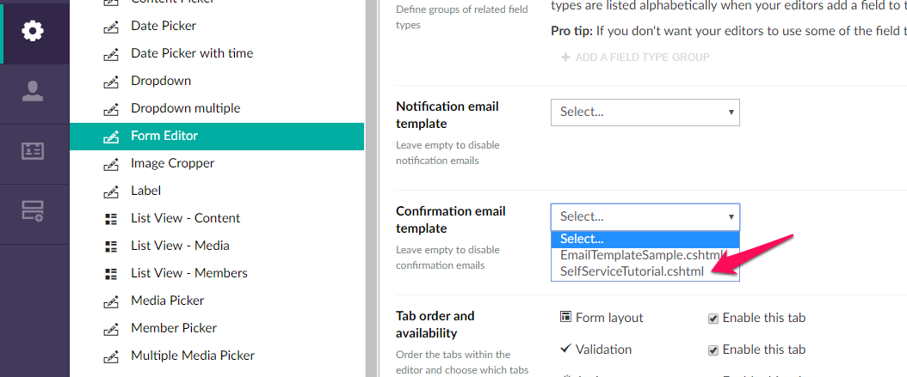
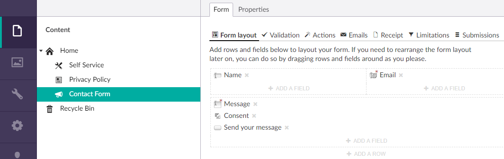
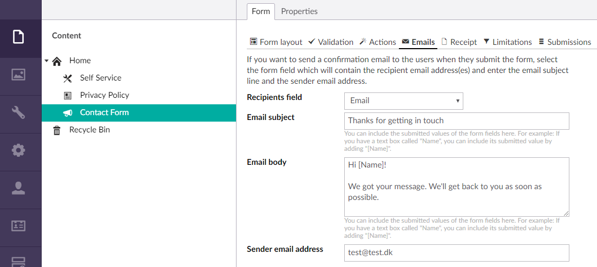
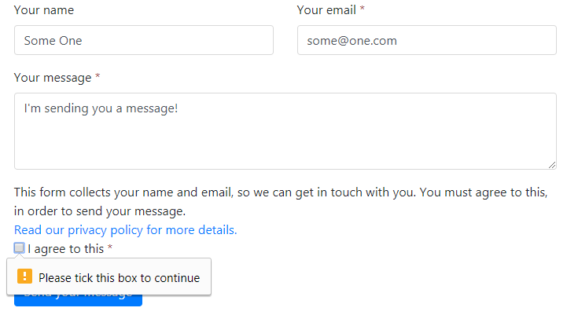
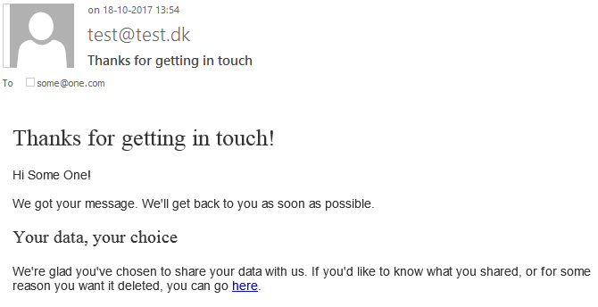
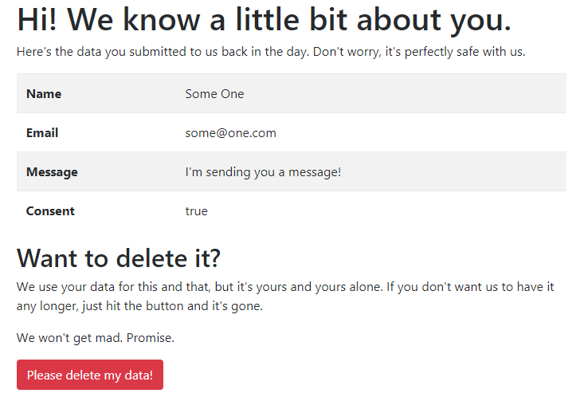

# Tutorial: GDPR self service

GDPR (General Data Protection Regulation) presents a [few new challenges](../Docs/TODO.md) for forms that collect any kind of personal data. Form Editor lets you be GDPR compliant out of the box... but you can be compliant in many ways - some smarter than other.

In this tutorial we'll apply a self service approach to the "Right of access" and "Right to erasure" in GDPR, by creating a page where the users can view and delete their own form submissions. 

Before we start, install and set up Form Editor if you haven't already (you need version 1.3 or higher). Check the [quick start tutorial](QuickStart.md) or the [installation documentation](../Docs/install.md) for details.

## Creating the Self Service page

Create a blank document type called *Self Service* and create a page of this type in the root of your site. We'll add a direct link to this page in the receipt email that's sent to the users when they submit a form. 

In order to fetch the submitted form data from any form, the page template will need:

- The ID of the page that contains the form (so we can find the form).
- The ID of the form submission (so we can find the form data).

We'll add these as query string parameters, `cid` and `rid` (for content ID and row ID, respectively).

The following code listing contains the template for the *Self Service* document type. For simplicity, everything is handled within the template itself (purists may want to separate this a bit). The flow is as follows:

1. The user clicks the link in the receipt email and lands on the *Self Service* page.
2. The template grabs `cid` and `rid` from the request, loads the form data and renders it.
3. The user clicks the "Delete" button.
4. The template detects the delete request (form submission), deletes the data and displays a success message.
5. If anything fails (e.g. malformed or invalid parameters), the template displays an error message.

```html
@using FormEditor;
@using FormEditor.Fields;
@inherits Umbraco.Web.Mvc.UmbracoTemplatePage
@{
  Layout = null;
  FieldWithValue[] fields = null;
  var removedData = false;
  var hasData = false;
  
  var contentId = 0;
  var rowId = Guid.Empty;  
  if(int.TryParse(Request["cid"], out contentId) && Guid.TryParse(Request["rid"], out rowId)) { 
    // get the content that contains the form model
    var content = Umbraco.TypedContent(contentId);
    if(content != null) {
      // get the form model (named "form" on the content type)
      var formModel = content.GetPropertyValue<FormModel>("form");
      if(formModel != null) {
        // did the user hit the delete button?
        if(Request["action"] == "remove") {
          // yep - flag this as a remove request and remove the data
          removedData = true;
          // remove the submission - remember to pass the content to RemoveValues() or it won't work
          formModel.RemoveValues(content, rowId);
        }
        else {
          // nope - load the data
          if(content != null) {
            // get the form model (named "form" on the content type)
            formModel = content.GetPropertyValue<FormModel>("form");
            if(formModel != null) {
              // load the current values - remember to pass the content to LoadValues() or it won't work
              formModel.LoadValues(content, rowId);
              
              // get the value fields from the form model and check if we have any data at all
              fields = formModel.AllValueFields().ToArray();
              hasData = fields.Any(f => f.HasSubmittedValue);
            }
          }
        }
      }
    }
  }
}
<!DOCTYPE html>
<html>
<head>
  <title>@Model.Content.Name</title>
  <link rel="stylesheet" href="http://getbootstrap.com/dist/css/bootstrap.min.css" />
</head>
<body>
  <div class="container">
  @if(removedData) {
    @* the user requested data removal *@
    <h1>Whoosh! Your data is gone :)</h1>
    <p>
      ...but don't be a stranger - you're welcome anytime!
    </p>
  }
  else {
    if(hasData) {
      <h1>Hi! We know a little bit about you.</h1>
      <p>
        Here's the data you submitted to us back in the day. Don't worry, it's perfectly safe with us. 
      </p>
      <table class="table table-striped">
        <tbody>
          @foreach(var field in fields)
          {
            <tr>
              <td><strong>@field.Name</strong></td>
              <td>@field.SubmittedValue</td>
            </tr>
          }
        </tbody>
      </table>
      <h2>Want to delete it?</h2>
      <p>
        We use your data for this and that, but it's yours and yours alone. If you don't want us to have it any longer, just hit the button and it's gone.
      </p>
      <p>
        We won't get mad. Promise.
      </p>
      <form method="POST">
        <input type="hidden" name="action" value="remove" />
        <button class="btn btn-danger" type="submit">Please delete my data!</button>
      </form>
    }
    else if(fields != null){
      <h1>Hi stranger!</h1>
      <p>
        We haven't got any of your data any longer... move along, nothing to see here.
      </p>
    }
    else {
      <h1>Whoops! Something went wrong.</h1>
      <p>
        How embarrassing... we can't find your data. <a href="/contact-us/">Get in touch</a> with us and we'll do our best to help you.
      </p>
    }
  }
  </div>
</body>
</html>
```

## Creating the email template

*If you've never used email templates with Form Editor, you can read about them [here](../Docs/emails.md).*

Create a copy of the sample email template EmailTemplateSample.cshtml in /Views/Partials/FormEditor/Email/ and rename it to *SelfServiceTutorial.cshtml*. Then edit the Form Editor data type and select *SelfServiceTutorial.cshtml* as confirmation email template.



Now open *SelfServiceTutorial.cshtml* and replace the contents of the file with the following code listing.

```html
@inherits Umbraco.Web.Mvc.UmbracoViewPage<FormEditor.FormModel>
@{
  // the content that contains the form is passed to the email template as ViewData["currentContent"]
  var currentContent = ViewData["currentContent"] as IPublishedContent;
  
  // find the Self Service page (located as a child to the site root)
  var selfServiceContent = currentContent.Ancestor(1).FirstChild(c => c.DocumentTypeAlias == "selfService");
}
<!DOCTYPE html>
<html>
<head>
  <title>Receipt</title>
  <style>
    body {
      font-family: Helvetica, Arial, sans-serif;
      font-size: 14px;
      line-height: 1.4;
      color: #333;
      background-color: #fff;
    }

    h1, h2 {
      font-family: inherit;
      font-weight: 500;
      line-height: 1.1;
      font-size: 26px;
    }

    h2 {
      font-size: 20px;
    }
  </style>
</head>
<body>
  <h1>Thanks for getting in touch!</h1>
  <p>
    @* add the interpolated confirmation email body text *@
    @Model.GetEmailConfirmationBodyText()
  </p>
  @if(selfServiceContent != null) {
    // add a link to the Self Service page with the parameters "cid" (ID of the content) and "rid" (ID of the form submission)
    <h2>Your data, your choice</h2>
    <p>
      We're glad you've chosen to share your data with us. If you'd like to know what you shared, or for some reason you want it deleted, 
      you can go <a href="@selfServiceContent.UrlWithDomain()?cid=@currentContent.Id&rid=@Model.RowId">here</a>.
    </p>
  }
</body>
</html>
```

## Let's test it!

Create a page with a form on it (of whatever type you've added the Form Editor property to). Add some fields to the form layout, including a *Text box* field and an *Email* field for the user's name and email respectively.

Remember: The GDPR requires explicit user consent for forms that collect personal data. You should add a *Submission consent* field to your form to collect user consent.



On the *Emails* tab of the Form Editor property, pick the *Email* field as the confirmation mail recipient field, and fill out the rest of the fields as you like:



Now go view the page in the frontend and submit the form: 



If everything is set up right, you should get a receipt email with a link to the Self Service page:



...and clicking the link will take you to the Self Service page, which should look something like this:



TODO: wrap-up
