# Using Zapier to integrate to other systems

In the following we're going to write form submissions to Google Sheets using [Zapier](https://zapier.com/). While this might seem a little pointless, it'll demonstrate how Zapier and Form Editor can work together to provide integration with a [wide range](https://zapier.com/zapbook/) of systems. We'll use Google Sheets here because it is one of the integration points that's available in the free version of Zapier.

When this tutorial is complete, we'll have a Google Sheet that contains contact information (first and last names + email address) for each form submission that's made.

*Note: If you've already read the [Azure Logic Apps](LogicApp.md) tutorial, a lot of this might feel a bit like deja-vu.*

## Before you start

Make sure you have Form Editor (version 1.2.1.0 or above) installed and set up. See the [quick start tutorial](QuickStart.md) or the [installation documentation](../Docs/install.md) for details. 

You'll also need accounts for Zapier and Google.

## Zapier and Zaps

In Zapier you create *Zaps* to connect systems. In its most rudimentary form, a Zap is made up by:

* A trigger that invokes the Zap. 
* One or more actions that interact with various systems. 

### Form data vs. Zapier

With the built-in [web service integration](../Docs/install_web_service.md), Form Editor can send the form data to an external web service whenever a form is submitted. We'll use this to connect our form to Zapier. 

Zapier needs to know the data format up front to make the data available throughout a Zap. This means we need to assume that the form fields we want to use within our Zap will be part of our form layout - in this case the contact information for our Google Sheet.

When Form Editor passes the form data to a web service, all the submitted values are wrapped in an object aptly named `submittedValues` ([read more](../Docs/install_web_service.md#the-data-format)). This object is perfect for our Zapier integration, because Zapier can create variables directly from it. With the expected contact information form fields, the `submittedValues` will contain at least the following data:

```json
{
  "submittedValues": {
    "_First_name": "Some",
    "_Last_name": "One",
    "_Email": "some@one.dk",
  }
}
```

*Note: `umbracoContentName`, `formData` and other fields are left out for brevity as we don't need them.*

*Note: The "form safe" names are used in the `submittedValues` object. If you're in doubt what that might be for a specific form field, you can always find it by inspecting the form field name in the rendered form.*

## Step 1: The Google Sheet

First and foremost, let's create the Google Sheet for our contact information. Simply create a sheet with three columns: *First name*, *Last name*, and *Email*. Zapier will identify the column names from the first row of the sheet when we set up the integration.

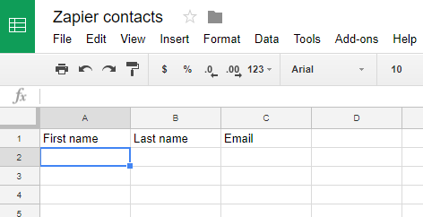

## Step 2: The Zap and its trigger

Start by creating a new Zap in Zapier. The first thing you'll be asked to do is to choose the trigger app for the Zap. Since we'll be sending form data to the Zap, we'll use the *Webhooks* app:

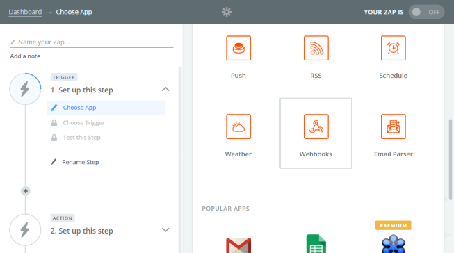

Select a *Catch Hook* as trigger. This exposes an endpoint which we can send JSON data to:

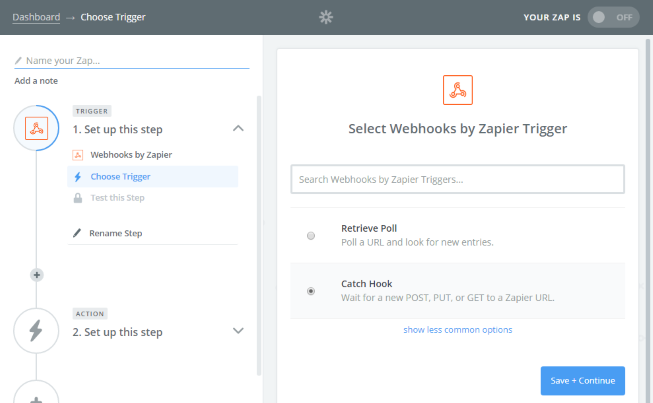

The trigger lets us specify which part of the JSON data we want to work with in the Zap. If we enter *submittedValues*, the properties of the `submittedValues` object will be turned into variables for the rest of our Zap.

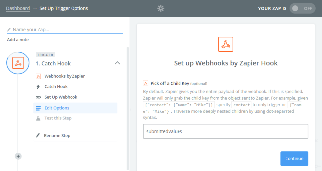

Last thing that remains is to test the trigger. Grab the *Webhook URL* and save it somewhere (we'll need it later too):

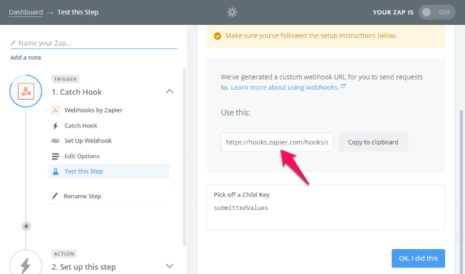

...then use [Postman](https://www.getpostman.com/) or a similar tool to POST the sample JSON to the *Webhook URL*:

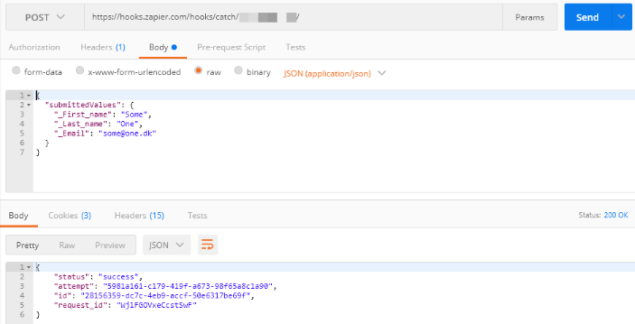

Once this is done, go back to the Zap and hit the *OK* button. You should see a success message. Behind the scenes, Zapier has now been made aware of the data format, and we can start using the properties from `submittedValues` in our action.

## Step 3: The Zap action

Now let's set up the Zap action that'll write the contact information to our Google Sheet. Start by picking Google Sheets as the app for the action:

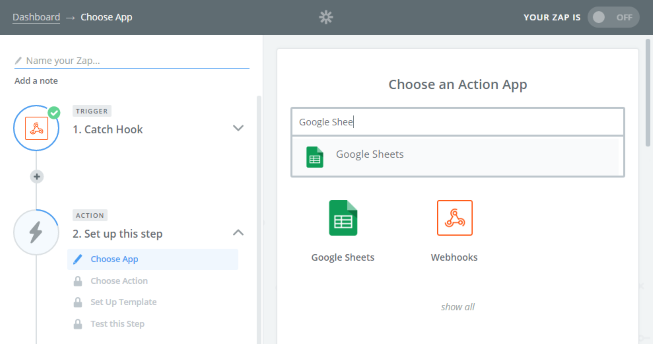

Each time our form is submitted, we want to add a row in our contact information sheet, so pick the *Create Spreadsheet Row* action:

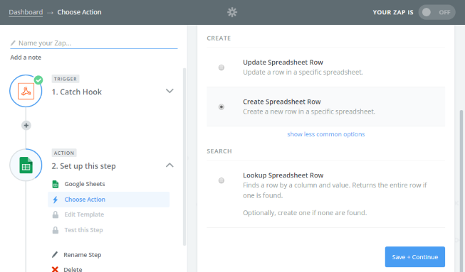

If you haven't already, you'll be asked to connect Zapier to your Google account. When that's done, pick the Google Sheet we created in step 1:

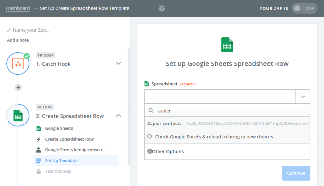

Once the Google Sheet is selected we can configure the action by mapping our variables (from the trigger) to their corresponding columns in the sheet:

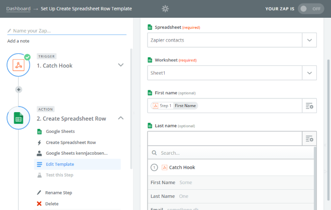

Lastly we get to test the action using the sample JSON from the trigger. If all goes well, we should see a row created in our sheet:

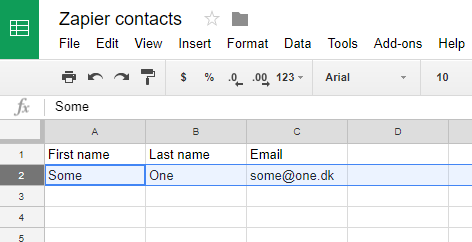

Our Zap is now finished. Give it a name and turn it on, so we can start using it.

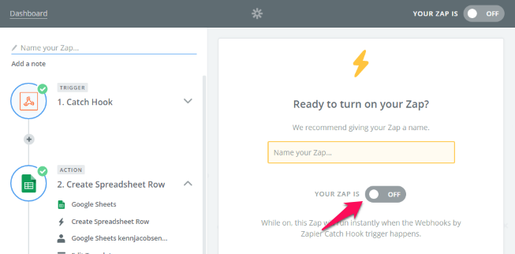

## Step 4: Set up Form Editor

With the Zap done, we need to tell Form Editor where to send form data. Simply enter the *Webhook URL* (the one you used to test the Zap trigger) in the *Web service URL* field of the Form Editor datatype configuration:

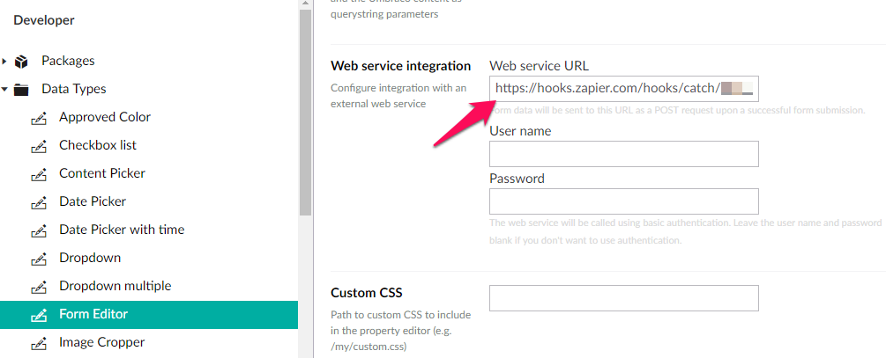

If you haven't already, create a form that contains (at least) the contact information fields:

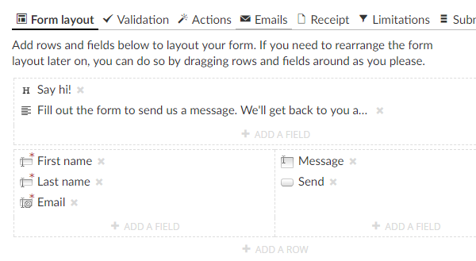

Now when you submit the form...

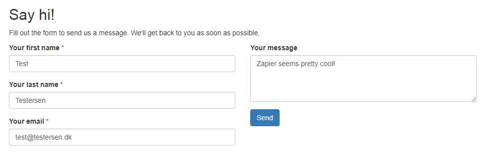

...a row is created in the Google Sheet:

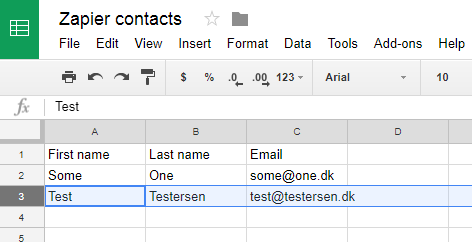

Pretty awesome, isn't it?
